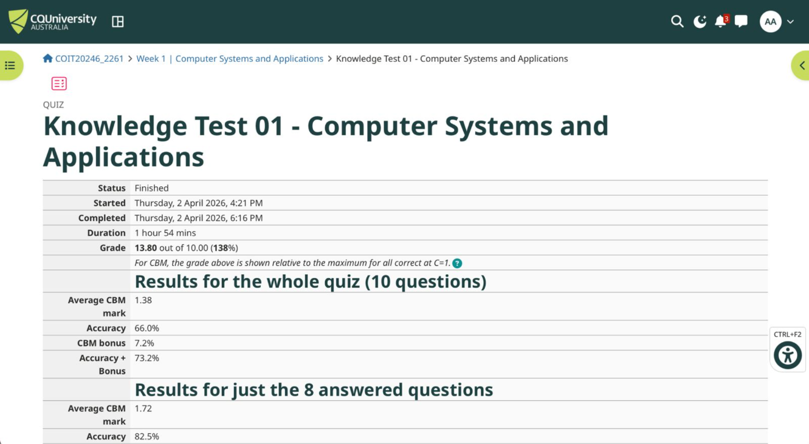
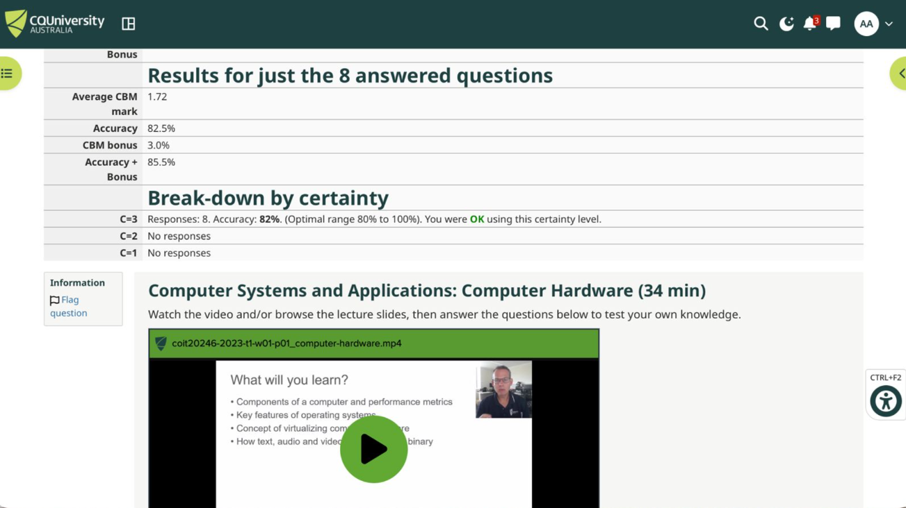
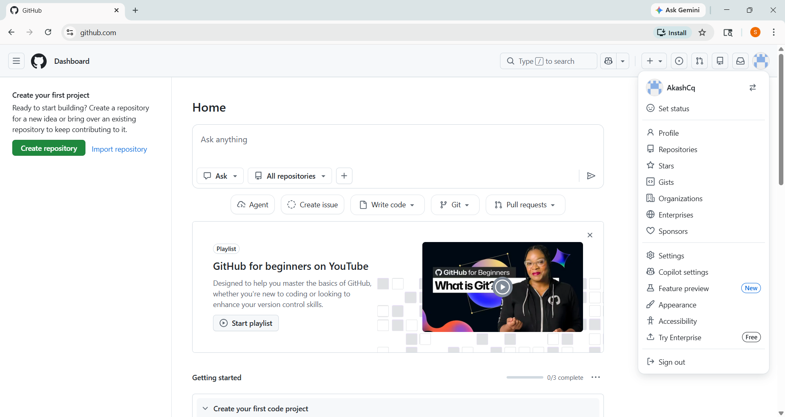

# Week 1 | Unit Introduction
Student Name: Akash Adhikary
Student ID: 12326091
Campus: Melbourne

---

## Task 1. Complete the Knowledge Test for Week 00

I completed the Knowledge Test for Week 00 (Unit Introduction) on Moodle at the start of Week 1.

---

## Task 2. Watch the Welcome to COIT20246 Video

I watched the "Welcome to COIT20246" video available on the Unit Introduction tile in Moodle via Echo360.

---

## Task 3. Explore the Moodle Site

I explored the Moodle site thoroughly, including all four main tiles and the Week 1 tile. Below are answers to the key questions:

- **Pre-recorded lecture videos:** Found in each weekly tile under the "Lecture" section, stored on Echo360.
- **Lecture slides (PDF and PPTX):** Available in each weekly tile under the lecture resources.
- **Online journal system:** GitHub (via GitHub Classroom — a repository is automatically created using the invite link).
- **Quiz 1 weight:** Found in the Assessment tile — Quiz 1 is worth **10%** of the unit grade.

---

## Task 4. Create GitHub Account

I created a free GitHub account and set up my journal repository via the GitHub Classroom invite link on Moodle.

---

## Task 5. Write Your Entry for Week 1 Journal

Below is a summary of my current knowledge across the four key topics of this unit.

---

### Computer Networking

- I have hands-on experience configuring **Cisco routers and switches** in lab environments using Cisco Packet Tracer
- I understand **subnetting in IPv4**, including CIDR notation and calculating network/broadcast addresses
- I have configured **pfSense firewall** rules and NAT for a PGVCL area network project
- I am familiar with network devices such as routers, switches, access points, and firewalls
- I have used **Wireshark** to capture and analyse network packets (TCP, UDP, ICMP protocols)

*Learned through:* Bachelor of Information Technology coursework — subjects covering Network Fundamentals and Network Security, as well as a practical internship involving PGVCL network infrastructure.

---

### The Internet

- I understand how **DNS** resolves domain names to IP addresses, including records (A, AAAA, MX, CNAME)
- I know how **HTTP/HTTPS** works, including TLS handshake and certificate verification
- I have studied how data travels using **TCP/IP protocol stack** and how routing works across the Internet
- I understand the role of **ISPs**, peering, and BGP at a conceptual level
- I am aware of **IPv4 address exhaustion** and the transition towards IPv6

*Learned through:* University courses on networking and independent study including Cisco CCNA study materials.

---

### Cyber Security

- I have experience with **network forensics and incident response**, including log analysis
- I understand common attack types: **phishing, SQL injection, man-in-the-middle, DDoS**
- I have configured **access control lists (ACLs)** and **IAM policies in AWS**
- I have studied **public key cryptography**, digital signatures, and certificate authorities
- I am familiar with **vulnerability assessment tools** such as Nmap and basic use of Metasploit

*Learned through:* University cybersecurity subjects and hands-on lab work in ethical hacking and digital forensics.

---

### Cloud Computing

- I have deployed and managed **virtual machines in AWS EC2**, including configuring security groups and key pairs
- I have worked with **AWS S3, IAM, RDS**, and VPC configurations
- I understand **cloud service models** (IaaS, PaaS, SaaS) and deployment models (public, private, hybrid)
- I have used **VMware Workstation and VirtualBox** extensively for virtualisation projects
- I have administered **Linux (Mint and Ubuntu)** systems in both cloud and local VM environments

*Learned through:* University cloud computing subjects and practical AWS projects as part of capstone assessments.

---

### Tools I Have Used

| Category              | Tools / Experience                                              |
|-----------------------|------------------------------------------------------------------|
| Operating System      | Windows 11, Linux Mint, Ubuntu Server                           |
| Virtualisation        | VMware Workstation, VirtualBox, AWS EC2                         |
| Networking Tools      | Cisco Packet Tracer, pfSense, Wireshark, Nmap                   |
| Cloud Platforms       | AWS (EC2, S3, IAM, RDS, VPC)                                    |
| Security Tools        | Basic Metasploit, Nmap, pfSense firewall                        |
| Programming           | Python, SQL, PHP                                                |
| Version Control       | GitHub                                                          |
| Database              | MySQL, PostgreSQL                                               |

---

The following is a screenshot of my Knowledge Test score for Week 00:

---

## Task 6. Visit the Microsoft Teams Site

I visited the Microsoft Teams site for COIT20246, installed Teams on my laptop, and posted a greeting message in the General channel.

[Completed]
