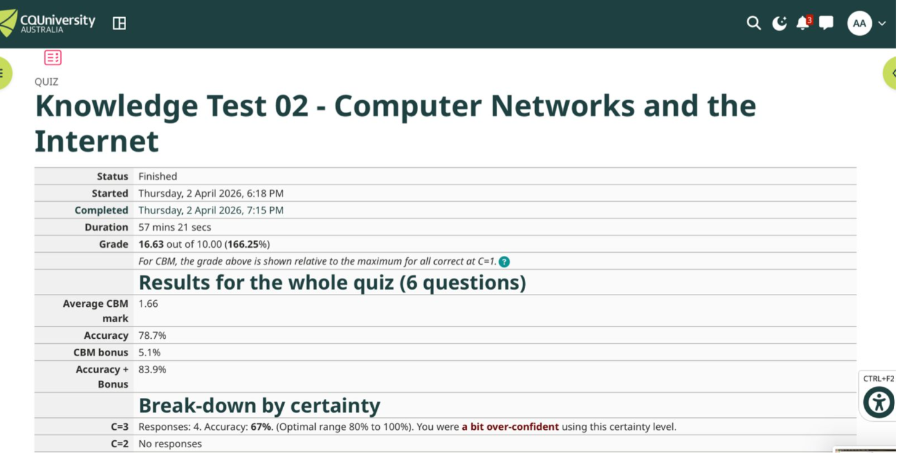
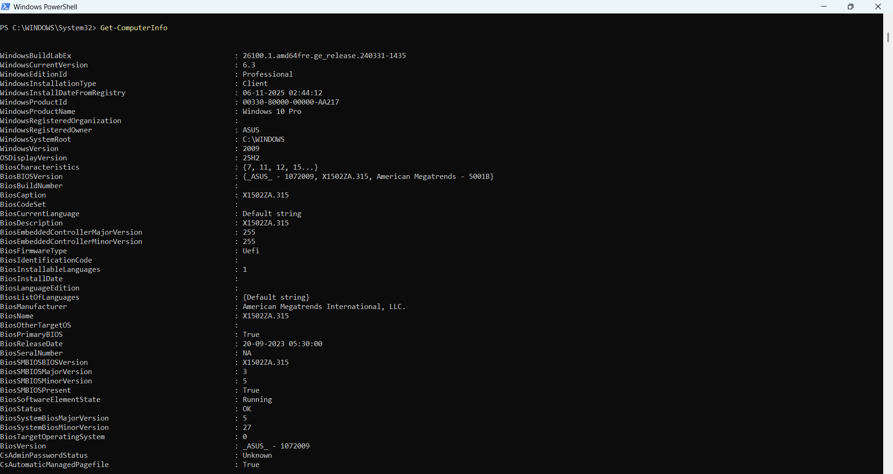
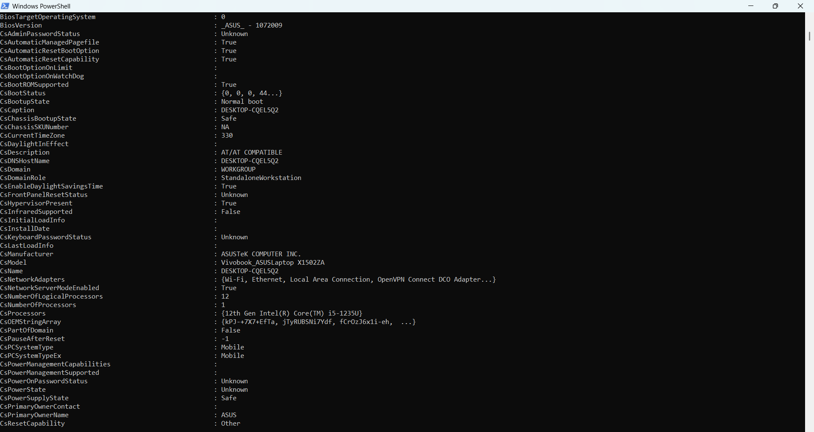
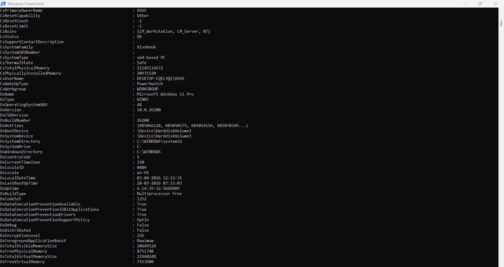
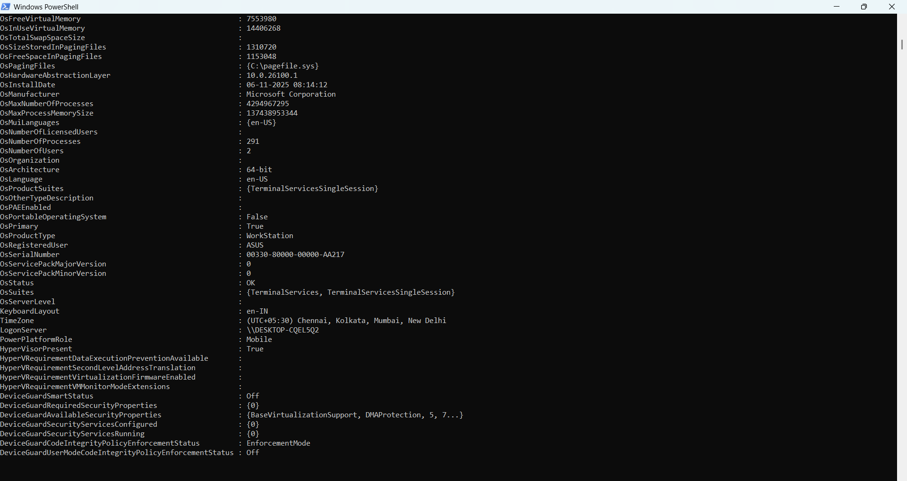
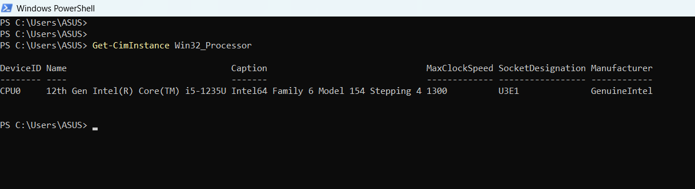
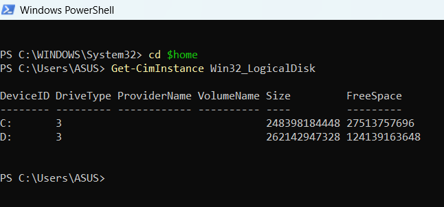
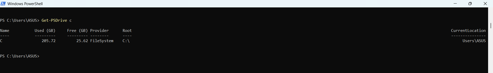
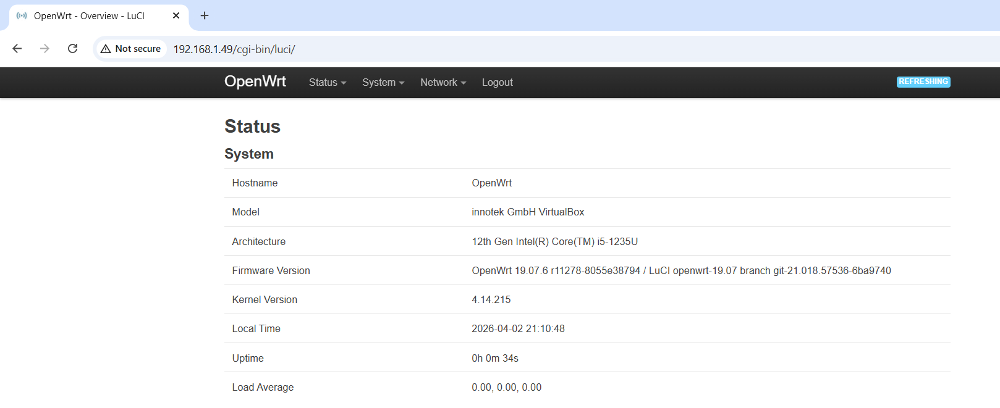
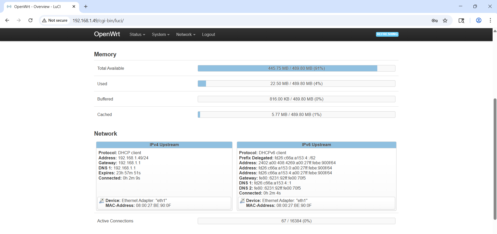

# Week 2 | Computer Systems and Applications
Student Name: Akash Adhikary
Student ID: 12326091
Campus: Melbourne

---

## Task 1. Complete the Knowledge Test

I completed Knowledge Test 01 — Computer Systems and Applications within the first 10 minutes of the tutorial.

- **Grade:** 13.80 out of 10.00 (138%)
- **Accuracy:** 66.0%
- **CBM Bonus:** 7.2%
- **Accuracy + Bonus:** 73.2%
- **Duration:** 1 hour 54 mins
- **Date Completed:** Thursday, 2 April 2026

---

## Task 2. View Your Computer Information

I used PowerShell commands to retrieve hardware and operating system information for my computer.

**Command used:** `Get-ComputerInfo` (run from `C:\Users\ASUS` after `cd $home`)

### Screenshots of Commands and Output

### Recorded Values

| Component        | Value (Raw)              | Value with Prefix             |
|------------------|--------------------------|-------------------------------|
| **CPU**          | Intel Core i5-1235U      | 12th Gen, Max 1300 MHz        |
| **Logical CPUs** | 12 cores                 | 12 logical processors         |
| **RAM (Total)**  | 21,145,116,672 bytes     | ~20,165 MB / ~19.69 GiB ≈ **20 GB** |
| **RAM (Free)**   | 8,751,740 KB             | ~8,546 MB / ~8.35 GB          |
| **Disk C: Size** | 248,398,184,448 bytes    | ~248.40 GB                    |
| **Disk C: Free** | 27,513,757,696 bytes     | ~27.51 GB                     |
| **Disk D: Size** | 262,142,947,328 bytes    | ~262.14 GB                    |
| **Disk D: Free** | 124,139,163,648 bytes    | ~124.14 GB                    |
| **OS**           | Microsoft Windows 11 Pro | Version 10.0.26200 (Build 26200) |
| **Architecture** | 64-bit x64               | 64-bit                        |
| **BIOS**         | UEFI                     | American Megatrends X1502ZA.315 |
| **Computer**     | ASUS Vivobook X1502ZA    | ASUSTeK COMPUTER INC.         |

**Notes on prefix conversion:**
- 1 GB = 1,000,000,000 bytes (SI prefix)
- 1 GiB = 1,073,741,824 bytes (binary prefix)
- RAM is commonly reported in GiB; 21,145,116,672 ÷ 1,073,741,824 ≈ **19.69 GiB**
- Disk C size: 248,398,184,448 ÷ 1,000,000,000 ≈ **248.4 GB**

---

## Task 3. Deploy Linux Web Server in VirtualBox

I installed the OpenWRT Linux Appliance in VirtualBox and observed the boot process.

### Boot Manager and Kernel

- **Boot Manager:** **GRUB (GNU GRand Unified Bootloader)**
  - Found by: When the VM starts in VirtualBox, the GRUB menu is briefly displayed before OpenWRT loads. VirtualBox uses its own internal BIOS emulation. The GRUB bootloader is embedded in the OpenWRT disk image and handles loading the Linux kernel.

- **Kernel:** **Linux 4.14.215**
  - Found by: Visible in the OpenWRT LuCI management interface under Status → Overview → System section showing "Kernel Version: 4.14.215".

### Description of VirtualBox

VirtualBox is a free, open-source **Type 2 (hosted) hypervisor** developed by Oracle Corporation. It runs on top of a host operating system (such as Windows 11) and allows users to create and run multiple **guest virtual machines (VMs)** simultaneously. Each VM is isolated from others and can run a different operating system. VirtualBox is widely used in education and development environments because it is free to use and supports a broad range of guest operating systems including Linux, Windows, and BSD.

### Description of OpenWRT

OpenWRT is an **open-source, Linux-based embedded operating system** originally designed for wireless routers but now also used as a lightweight network server. It replaces the default firmware on supported hardware (or runs inside a VM) and provides a fully writable filesystem with a package manager (`opkg`), allowing users to install and configure custom software. In this unit, we use OpenWRT as a lightweight Linux web server running inside VirtualBox to practice Linux commands, network configuration, and packet capture.

### AI-Generated Description (ChatGPT)

**Prompt used:** *"Give me a short description of VirtualBox and OpenWRT suitable for a new IT student."*

> **VirtualBox** is a free virtualization software by Oracle that lets you run multiple operating systems (like Linux or Windows) simultaneously inside your current operating system. It creates isolated virtual machines, making it ideal for testing and learning. **OpenWRT** is an open-source Linux distribution designed for routers and embedded systems. It replaces default router firmware with a customizable, feature-rich OS, giving you fine-grained control over network settings. When installed in VirtualBox, it acts as a lightweight virtual Linux server for networking labs.

**Comparison:** The AI description is accurate and concise. The main difference is that my description includes more technical detail — specifically the Type 2 hypervisor classification for VirtualBox, the `opkg` package manager for OpenWRT, and how we use OpenWRT specifically in this unit for packet capture and Linux practice. The AI description is broader and more introductory, which is appropriate for a general audience, but my version is more specific to our lab context.

---

## Task 4. Browse to OpenWRT Websites

I started the OpenWRT VM in VirtualBox and accessed the LuCI management interface via browser at `http://192.168.1.49/cgi-bin/luci/`.

### Screenshots

### OpenWRT System Information

| Field              | Value                                                        |
|--------------------|--------------------------------------------------------------|
| **Hostname**       | OpenWrt                                                      |
| **Model**          | innotek GmbH VirtualBox                                      |
| **Architecture**   | 12th Gen Intel(R) Core(TM) i5-1235U                         |
| **Firmware**       | OpenWrt 19.07.6 r11278-8055e38794 / LuCI openwrt-19.07     |
| **Kernel Version** | 4.14.215                                                     |
| **Local Time**     | 2026-04-02 21:10:48                                          |
| **Uptime**         | 0h 0m 34s                                                    |
| **Load Average**   | 0.00, 0.00, 0.00                                             |

### OpenWRT Memory Information

| Field              | Value                            |
|--------------------|----------------------------------|
| **Total RAM**      | 489.80 MB                        |
| **Available RAM**  | 445.75 MB (91%)                  |
| **Used RAM**       | 22.50 MB (4%)                    |
| **Buffered**       | 816.00 KB (0%)                   |
| **Cached**         | 5.77 MB (1%)                     |

### OpenWRT Network Information

| Field              | IPv4 Upstream         | IPv6 Upstream                          |
|--------------------|-----------------------|----------------------------------------|
| **Protocol**       | DHCP client           | DHCPv6 client                          |
| **Address**        | 192.168.1.49/24       | 2402:a00:408:4269:a00:27ff:febe:900f/64 |
| **Gateway**        | 192.168.1.1           | fe80::6231:92ff:fe00:70f5              |
| **DNS 1**          | 192.168.1.1           | fd26:c66a:a153:4::1                    |
| **DNS 2**          | —                     | fe80::6231:92ff:fe00:70f5              |
| **Device**         | Ethernet Adapter eth1 | Ethernet Adapter eth1                  |
| **MAC Address**    | 08:00:27:BE:90:0F     | 08:00:27:BE:90:0F                      |
