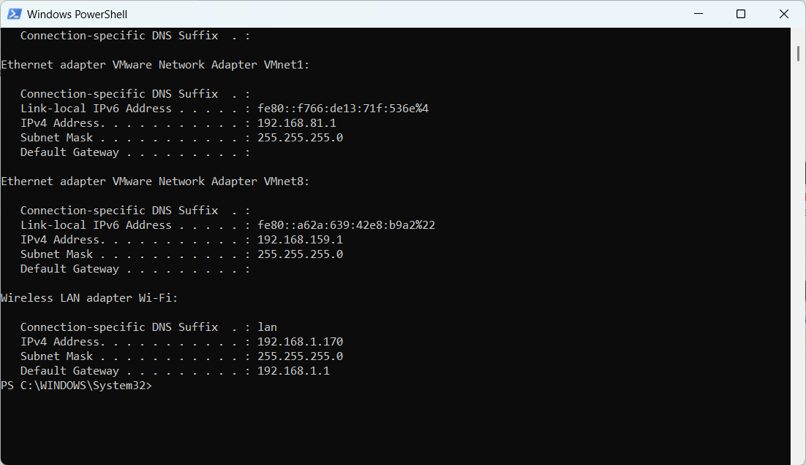
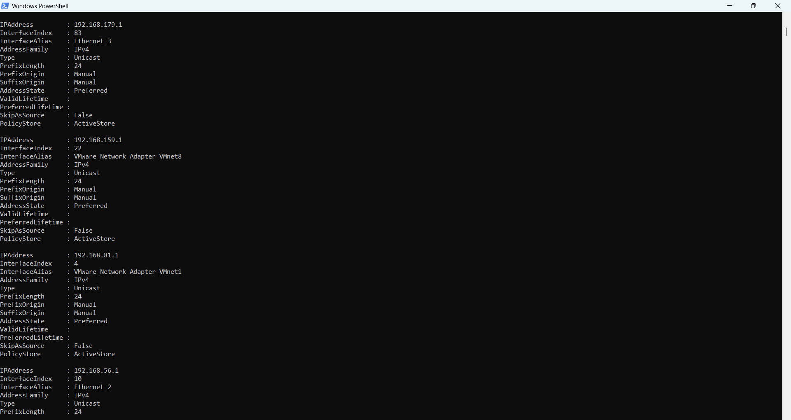
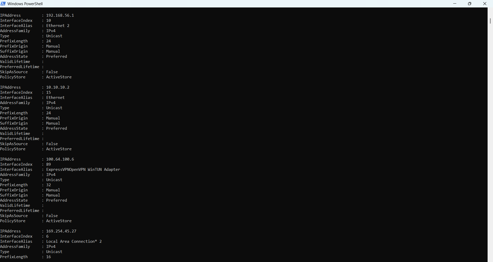
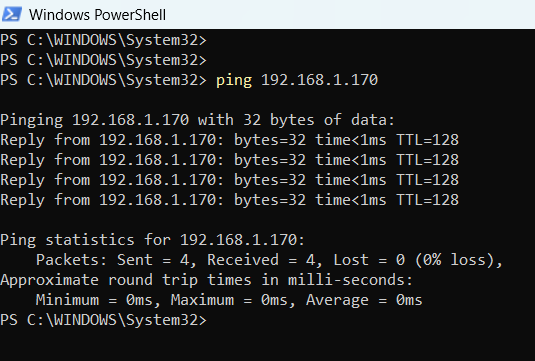
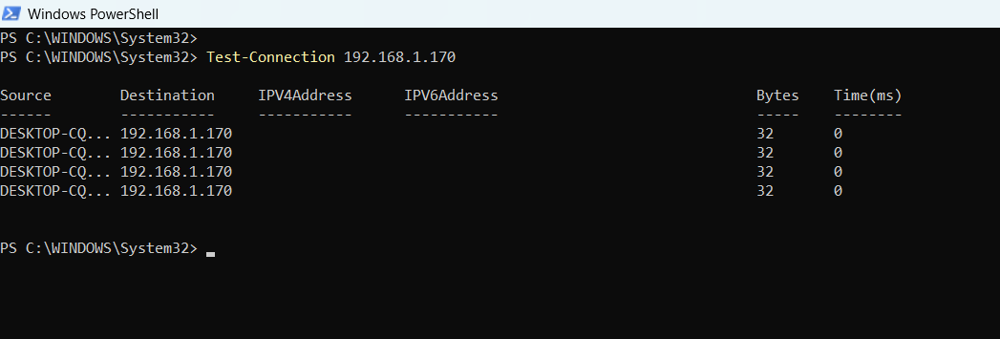
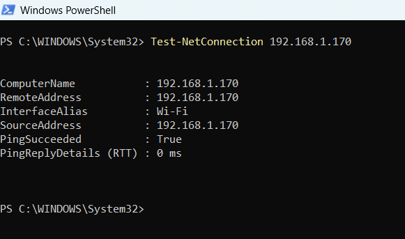
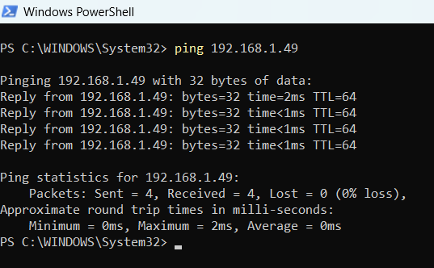
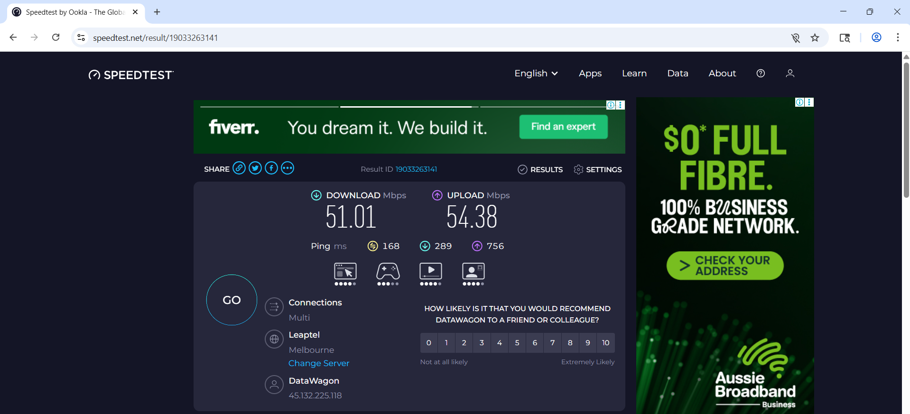

# Week 3 | Computer Networks and the Internet
Student Name: Akash Adhikary
Student ID: 12326091
Campus: Melbourne

---

## Task 1. Complete the Knowledge Test

I completed the Knowledge Test for Week 3 — Network Technologies within the first 10 minutes of tutorial.

- **Grade:** 30.00 out of 10.00 (300%)
- **Accuracy:** 100%
- **CBM Bonus:** 0%
- **Average CBM Mark:** 3.00
- **Questions:** 5
- **Date Completed:** Thursday, 2 April 2026


---

## Task 2. View Your Addresses

I used two PowerShell commands to view all network addresses on my computer:
- `ipconfig` — shows interface IP addresses, subnet masks, and default gateway
- `Get-NetIPAddress` — shows full detail of all assigned IP addresses

### Screenshots





### Address Values and Descriptions

| Interface                        | IP Address         | Prefix | What It Identifies                                                                 |
|----------------------------------|--------------------|--------|------------------------------------------------------------------------------------|
| **Wi-Fi**                        | 192.168.1.170      | /24    | My laptop's IPv4 address on the local home wireless network                       |
| **Default Gateway (Router)**     | 192.168.1.1        | —      | The local router that connects my device to the wider Internet                    |
| **VMware VMnet1**                | 192.168.81.1       | /24    | VMware host-only virtual network adapter for VMs using Host-Only networking       |
| **VMware VMnet8**                | 192.168.159.1      | /24    | VMware NAT virtual network adapter for VMs using NAT mode networking              |
| **Ethernet 3**                   | 192.168.179.1      | /24    | Another virtual network adapter (manual/static assignment)                        |
| **Ethernet 2 / VirtualBox**      | 192.168.56.1       | /24    | VirtualBox Host-Only network adapter                                               |
| **Ethernet (index 15)**          | 10.10.10.2         | /24    | Private static IP on a local Ethernet network                                     |
| **ExpressVPN OpenVPN Adapter**   | 100.64.100.6       | /32    | VPN tunnel interface IP assigned by ExpressVPN (CGNAT range 100.64.x.x)          |
| **Local Area Connection* 2**     | 169.254.45.27      | /16    | APIPA address — assigned automatically when no DHCP server responds               |

---

## Task 3. Ping Your Local Router

I first identified the **default gateway (local router)** IP address using `ipconfig`:

- **Router IP Address:** `192.168.1.1`
- **My Computer's Wi-Fi IP:** `192.168.1.170`

### Screenshots





### Commands Used

```powershell
ipconfig
ping 192.168.1.170
Test-Connection 192.168.1.170
Test-NetConnection 192.168.1.170
```

### Delay Results

| Metric           | Value |
|------------------|-------|
| **Minimum delay**| 0 ms  |
| **Maximum delay**| 0 ms  |
| **Average delay**| 0 ms  |

### How I Found the Values

The `ping` command output shows "Approximate round trip times in milli-seconds: Minimum = 0ms, Maximum = 0ms, Average = 0ms". The `Test-NetConnection` confirmed PingSucceeded: True with RTT of 0ms.

### Factors That Impact Delay

The extremely low delay (0 ms) is expected because the destination is within the same local Wi-Fi network on the same subnet (192.168.1.0/24). Several factors can affect ping delay and cause it to vary over time:

1. **Physical medium and distance** — Wireless signals travel through air and are affected by distance from the router, walls, and interference. Wired Ethernet produces lower and more stable delays.
2. **Network congestion** — If many devices are simultaneously using the network, the router queue builds up and packets wait longer before being processed, increasing delay.
3. **Router processing load** — A busy or underpowered router takes more time to process and respond to ICMP packets, especially during peak usage.
4. **Wi-Fi interference** — Packet loss and retransmissions due to poor signal quality increase round-trip time. The 0 ms readings here suggest excellent signal quality and low network load at the time of testing.
5. **Time of day** — Peak evening hours typically have more devices active on the network, leading to higher delays compared to off-peak times.

---

## Task 4. Ping Your OpenWRT Linux Server

I started the OpenWRT VM in VirtualBox and retrieved its network addresses.

### OpenWRT Server Addresses

Obtained by running `ip addr` and `ip link` inside the OpenWRT terminal:

```
Interface: eth1
  Link-layer (MAC) address: 08:00:27:be:90:0f
  IPv4 address:             192.168.1.49/24
  IPv6 address (global):    2402:a00:408:4269:a00:27ff:febe:900f/64
  IPv6 address (link-local):fe80::a00:27ff:febe:900f/64
```

### Commands Used to Obtain Addresses

```bash
ip link        # shows interface names and MAC addresses
ip addr        # shows all assigned IP addresses per interface
```

### Commands Used to Capture Packets and Ping

On OpenWRT (start packet capture):
```bash
tcpdump -i eth1 -w /tmp/week3-task4-ping.pcap
```

On Windows PowerShell (perform ping):
```powershell
ping 192.168.1.49
```

Transfer .pcap to Windows via SCP:
```bash
scp root@192.168.1.49:/tmp/week3-task4-ping.pcap .
```

### Screenshot of Ping to OpenWRT



### Ping Results

- **Packets Sent:** 4 | **Received:** 4 | **Lost:** 0 (0% loss)
- Minimum = 0ms, Maximum = 2ms, Average = 0ms

The pcap file `week3-task4-ping.pcap` has been uploaded to this repository.

---

## Task 5. Academic Integrity Policy

I visited the CQU Policy website at https://www.cqu.edu.au/policy and downloaded the **Student Academic Integrity Policy and Procedure**. The PDF has been uploaded to this repository.

### Five Levels of Breach of Academic Integrity

According to the CQU Student Academic Integrity Policy and Procedure, the five levels of breach are:

1. **Level 1 — Minor breach**
2. **Level 2 — Moderate breach**
3. **Level 3 — Significant breach**
4. **Level 4 — Serious breach**
5. **Level 5 — Extreme breach**

---

## Task 6. Print GitHub Journal Page to PDF

I visited my `week03.md` journal page on GitHub and used the browser Print function to save as `week03.pdf`. This file has **not** been uploaded to the repository as per task instructions.

---

## Task 7. Find Addresses of a Website (Homework)

**Selected website:** `www.bom.gov.au` (Australian Bureau of Meteorology)

### Addresses Found

| Address Type     | Value                  | How Found                                         |
|------------------|------------------------|---------------------------------------------------|
| **Domain Name**  | www.bom.gov.au         | The URL itself                                    |
| **IPv4 Address** | 203.15.69.41           | PowerShell: `Resolve-DnsName www.bom.gov.au`     |
| **IPv6 Address** | Not available          | No AAAA record returned — BOM does not publish IPv6 |
| **MAC Address**  | Cannot be determined   | MAC addresses are Layer 2 only; not routed over the Internet |

**Command used:**
```powershell
Resolve-DnsName www.bom.gov.au
```

**Why IPv6 is not available:** The BOM website does not have an AAAA DNS record, meaning it has not been configured for IPv6. This is common for older government websites not yet migrated to IPv6.

**Why MAC address cannot be found:** MAC addresses operate at Layer 2 (Data Link Layer) and are only used within local network segments. When accessing a remote website over the Internet, the server's MAC address is never transmitted — only IP addresses are routed across the Internet.

---

## Task 8. Home Internet Connection (Homework)

### Connection Details

| Property             | Value                  |
|----------------------|------------------------|
| **Connection Type**  | NBN (Wi-Fi to modem)   |
| **ISP**              | DataWagon / Leaptel    |
| **Location**         | Melbourne, Australia   |

### Speed Test Results

**Test 1 — Leaptel Server:**


| Metric      | Value       |
|-------------|-------------|
| Download    | 51.01 Mbps  |
| Upload      | 54.38 Mbps  |
| Ping        | 168 ms      |
| Server      | Leaptel, Melbourne |

**Test 2 — Superloop Server:**



| Metric      | Value       |
|-------------|-------------|
| Download    | 52.57 Mbps  |
| Upload      | 40.83 Mbps  |
| Ping        | 166 ms      |
| Server      | Superloop, Melbourne |

### Discussion

**Why does the speed test change at different times?**

1. **Network congestion** — During peak hours (evenings, 6–10 PM), more households stream and browse simultaneously, causing congestion and lower throughput.
2. **Server selection** — Test 1 used Leaptel and Test 2 used Superloop. Different servers have different load levels and physical distances, resulting in different measured speeds.
3. **Wi-Fi interference** — Environmental interference from neighbouring networks or Bluetooth devices can reduce wireless throughput between tests.
4. **ISP throttling** — Some ISPs reduce speeds during peak periods for certain traffic types or after a data quota is approached.

**Why is the speed test different from the advertised data rate?**

The advertised NBN data rate represents the **maximum theoretical speed** under ideal conditions. In practice, the speed test measures actual end-to-end throughput affected by:
- Wi-Fi overhead and signal quality (wireless adds significant overhead vs wired)
- Congestion at the ISP network or test server
- Multiple hops between the home router and the test server (ping of 166–168 ms indicates moderate latency)

The measured download of ~51–52 Mbps is consistent with an **NBN50 plan**, confirming the connection is performing near its rated maximum limit.
