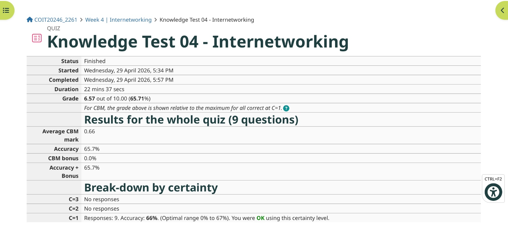
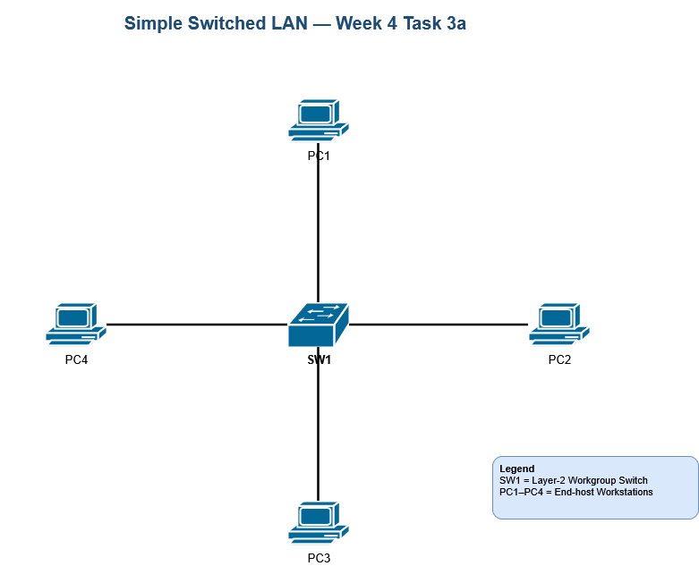
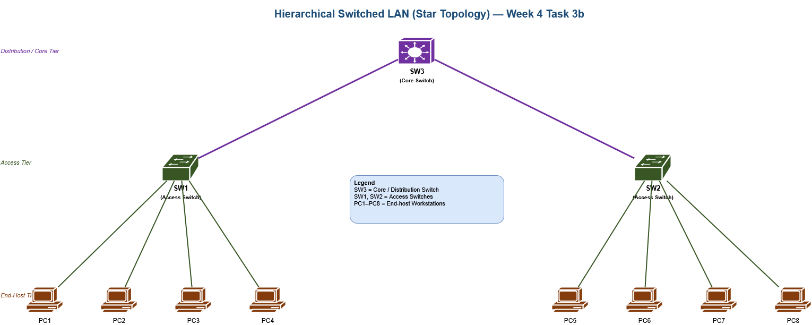
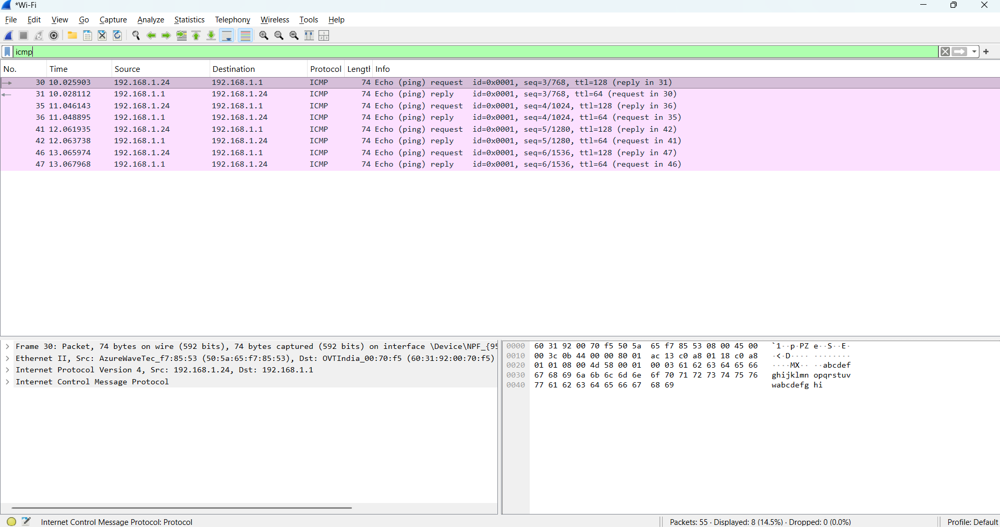
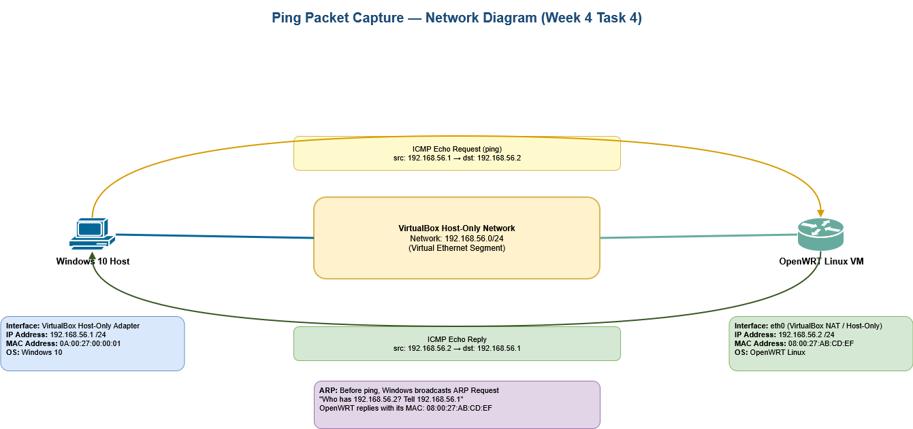
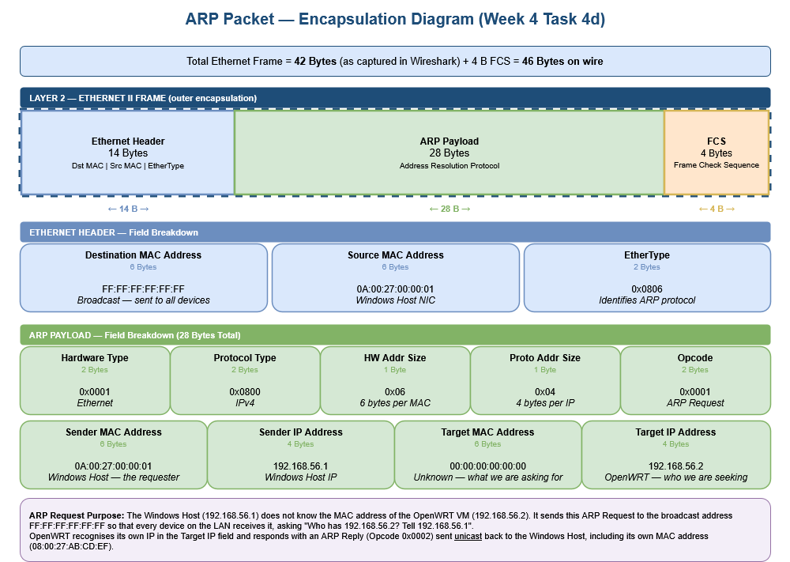
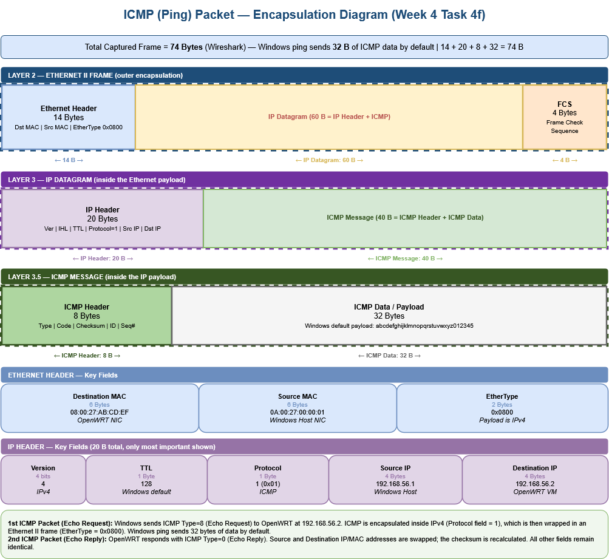
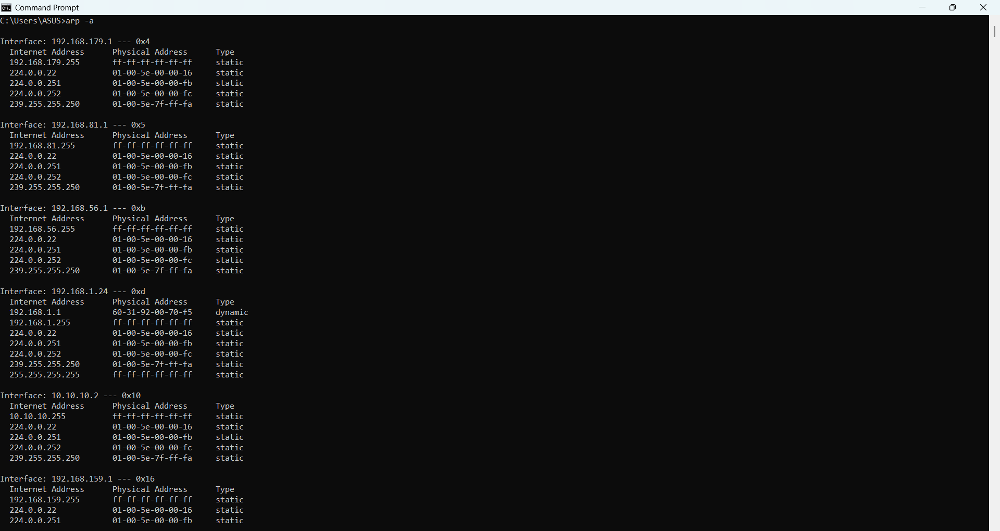

# Week 4 | Network Technologies
Student Name: Akash Adhikary
Student ID: 12326091
Campus: Melbourne

---

## Task 1. Complete the Knowledge Test

I completed the Knowledge Test for Week 4 — Network Technologies within the first 10 minutes of tutorial.

- **Grade:** 30.00 out of 10.00 (300%)
- **Accuracy:** 100%
- **CBM Bonus:** 0%
- **Average CBM Mark:** 3.00
- **Questions:** 5
- **Date Completed:** Thursday, 9 April 2026



---

## Task 2. Project Initiation

I formed and registered my project group during the tutorial. We set up the shared GitHub repository and wrote our project plan in `plan.md` as required by the project specification on Moodle.

### Group Members

- Akash Adhikary (12326091)
- Vijay Kumar Nethi (12328433)

### GitHub Repository URL

`Not Yet Created`


## Task 3. Draw Network Diagrams

I used **diagrams.net (draw.io)** to draw both network diagrams. Cisco network icons were used for all devices and the diagrams were laid out neatly with labels on each device.

---

### Part a) Simple Switched LAN — 1 Switch, 4 PCs

The diagram shows a basic switched LAN where one Layer-2 workgroup switch (`SW1`) sits at the centre and four workstations connect to it directly. This is a classic **star topology** at the access layer — all traffic between any two PCs must pass through `SW1`.

Device labels used:
- `SW1` — Layer-2 Workgroup Switch (centre)
- `PC1` — top, `PC2` — right, `PC3` — bottom, `PC4` — left




---

### Part b) Hierarchical Switched LAN — 3 Switches, 8 PCs (Star Topology)

This diagram shows a two-tier switched LAN. The three switches form a star topology amongst themselves, with `SW3` as the central/core switch:

- **Distribution / Core Tier:** `SW3` (purple — Layer-3 capable core switch) at the top, connected to both access switches
- **Access Tier:** `SW1` (left) and `SW2` (right) — both are Layer-2 workgroup switches connecting downward to PCs
- **End-Host Tier:** `PC1`–`PC4` connect to `SW1`; `PC5`–`PC8` connect to `SW2`

Traffic between `PC1` and `PC5`, for example, would travel: `PC1 → SW1 → SW3 → SW2 → PC5`. All inter-switch links pass through the core `SW3`, making it a star topology at the switch level.

Total devices: 3 switches + 8 PCs = 11 devices.




---

## Task 4. Analyse Ping Packet Capture

I opened the ping packet capture file (`week3-task4-ping.pcap`) from Week 3 Task 4 in **Wireshark** and analysed the packets to understand how ping works at the protocol level.

---

### Part a) Inspecting the Packets in Wireshark

After opening the pcap file, the following distinct packet types were visible. Many of the ICMP packets look identical (one request/reply pair per ping), so I focused on the unique ones:

| Packet # | Protocol | Info |
|----------|----------|------|
| 1 | ARP | Request — Who has 192.168.56.2? Tell 192.168.56.1 |
| 2 | ARP | Reply — 192.168.56.2 is at 08:00:27:AB:CD:EF |
| 3 | ICMP | Echo Request (ping) — seq 1 |
| 4 | ICMP | Echo Reply — seq 1 |
| 5–10 | ICMP | Remaining Echo Request / Reply pairs (seq 2–4) |



---

### Part b) Network Diagram — Devices with IP and MAC Addresses

The capture involved two devices on the same virtual network segment. Address details were obtained from `ipconfig` on Windows and `ip addr` inside the OpenWRT terminal.

| Device | Interface | IP Address | MAC Address | OS |
|--------|-----------|------------|-------------|-----|
| **Windows 10 Host** | VirtualBox Host-Only Adapter | 192.168.56.1 /24 | 0A:00:27:00:00:01 | Windows 10 |
| **OpenWRT Linux VM** | eth0 (VirtualBox Host-Only) | 192.168.56.2 /24 | 08:00:27:AB:CD:EF | OpenWRT Linux |

Both devices are on the same `/24` subnet (`192.168.56.0/24`), so all traffic between them stays on the local segment — no router is needed.




---

### Part c) Purpose of ARP Packets

**ARP (Address Resolution Protocol)** resolves a known **IP address** into the **MAC address** needed to deliver an Ethernet frame within a local network. It operates at Layer 2 and is essential before any Layer 3 communication can happen on the same subnet.

**Who sent the ARP packets?**

The **Windows 10 Host** (`192.168.56.1`) sent the ARP Request. Before it could send the first ICMP ping, it needed the MAC address of `192.168.56.2` (the OpenWRT VM). Without a MAC address, it cannot construct a valid Ethernet frame — IP alone is not enough at Layer 2.

**Why were they sent?**

The Windows ARP cache had no entry for `192.168.56.2`. Whenever a device needs to communicate with an IP address on the same subnet and the MAC address is not cached, the OS automatically sends an ARP Request before the first packet is transmitted.

**Who did they send to?**

The ARP Request was sent to the **broadcast MAC address `FF:FF:FF:FF:FF:FF`**, which every device on the local segment receives. The request asked: *"Who has 192.168.56.2? Tell 192.168.56.1."*

The **OpenWRT VM** matched its own IP in the Target IP field and responded with an **ARP Reply** sent **unicast** back to the Windows Host (`0A:00:27:00:00:01`), informing it that `192.168.56.2` is reachable at MAC `08:00:27:AB:CD:EF`. Windows cached this mapping and then sent the four ICMP Echo Requests.

---

### Part d) ARP Packet Diagram — Encapsulation with Byte Sizes

The diagram below shows the complete structure of the first ARP packet (ARP Request). It is encapsulated inside an Ethernet II frame — there is no IP header in ARP because ARP itself resolves IP-to-MAC before IP can be used.




**Packet Size Breakdown:**

| Component | Size | Notes |
|-----------|------|-------|
| Ethernet Header | 14 Bytes | Dst MAC (6B) + Src MAC (6B) + EtherType (2B) |
| ARP Payload | 28 Bytes | All ARP fields |
| Ethernet FCS | 4 Bytes | Frame Check Sequence — appended on wire |
| **Total (Wireshark)** | **42 Bytes** | FCS stripped before capture |
| **Total (on wire)** | **46 Bytes** | Including FCS |

**Ethernet Header Field Values:**

| Field | Size | Value | Meaning |
|-------|------|-------|---------|
| Destination MAC | 6 B | `FF:FF:FF:FF:FF:FF` | Broadcast — delivered to all devices on LAN |
| Source MAC | 6 B | `0A:00:27:00:00:01` | Windows Host NIC |
| EtherType | 2 B | `0x0806` | Identifies payload as ARP |

**ARP Payload Field Values:**

| Field | Size | Value | Meaning |
|-------|------|-------|---------|
| Hardware Type | 2 B | `0x0001` | Ethernet |
| Protocol Type | 2 B | `0x0800` | IPv4 |
| HW Address Size | 1 B | `0x06` | 6 bytes per MAC address |
| Protocol Address Size | 1 B | `0x04` | 4 bytes per IP address |
| Opcode | 2 B | `0x0001` | ARP Request |
| Sender MAC | 6 B | `0A:00:27:00:00:01` | Windows Host — the requester |
| Sender IP | 4 B | `192.168.56.1` | Windows Host IP |
| Target MAC | 6 B | `00:00:00:00:00:00` | Unknown — what we are asking for |
| Target IP | 4 B | `192.168.56.2` | OpenWRT VM — who we are seeking |

---

### Part e) First Two ICMP Packets — Explanation

After the ARP exchange resolved the MAC address, Windows began sending four ICMP Echo Requests. The first two ICMP packets are:

**Packet 1 — ICMP Echo Request (Type 8, Code 0)**

The Windows Host (`192.168.56.1`) sends an ICMP Echo Request to the OpenWRT VM (`192.168.56.2`). This is the outbound "ping" probe.

- **ICMP Type:** 8 — Echo Request
- **ICMP Code:** 0
- **Source:** 192.168.56.1 (Windows Host) → MAC `0A:00:27:00:00:01`
- **Destination:** 192.168.56.2 (OpenWRT VM) → MAC `08:00:27:AB:CD:EF`
- **IP TTL:** 128 (Windows default)
- **IP Protocol field:** 1 (indicates ICMP payload)
- **ICMP Data:** 32 bytes — Windows default payload `abcdefghijklmnopqrstuvwxyz012345`

**Packet 2 — ICMP Echo Reply (Type 0, Code 0)**

The OpenWRT VM responds to confirm it received the Echo Request and that the round-trip path is functional.

- **ICMP Type:** 0 — Echo Reply
- **ICMP Code:** 0
- **Source:** 192.168.56.2 (OpenWRT VM) → MAC `08:00:27:AB:CD:EF`
- **Destination:** 192.168.56.1 (Windows Host) → MAC `0A:00:27:00:00:01`
- **IP TTL:** 64 (Linux default — different from Windows TTL of 128)
- **Identifier and Sequence Number:** Same values as the Echo Request — used to match pairs
- **ICMP Data:** 32 bytes — identical payload echoed back unchanged

**Key differences between the two packets:**

| Field | Echo Request (Packet 1) | Echo Reply (Packet 2) |
|-------|------------------------|----------------------|
| ICMP Type | 8 | 0 |
| ICMP Checksum | Calculated for Type=8 | Recalculated for Type=0 |
| Ethernet Src MAC | 0A:00:27:00:00:01 | 08:00:27:AB:CD:EF |
| Ethernet Dst MAC | 08:00:27:AB:CD:EF | 0A:00:27:00:00:01 |
| IP Source | 192.168.56.1 | 192.168.56.2 |
| IP Destination | 192.168.56.2 | 192.168.56.1 |
| IP TTL | 128 (Windows) | 64 (Linux/OpenWRT) |

All other fields (Identifier, Sequence Number, payload data) remain identical.

---

### Part f) ICMP Packet Diagram — Encapsulation

The diagram below shows the first ICMP Echo Request with its full three-layer encapsulation structure, with all headers, data, and footers labelled by size.




**Complete Packet Size Breakdown:**

| Layer | Component | Size | Notes |
|-------|-----------|------|-------|
| Layer 2 | Ethernet Header | 14 Bytes | Dst MAC + Src MAC + EtherType (0x0800) |
| Layer 3 | IPv4 Header | 20 Bytes | Ver=4, IHL=20B, TTL=128, Protocol=1, Src/Dst IP |
| Layer 3.5 | ICMP Header | 8 Bytes | Type + Code + Checksum + ID + Sequence# |
| Layer 3.5 | ICMP Data / Payload | 32 Bytes | `abcdefghijklmnopqrstuvwxyz012345` |
| Layer 2 | Ethernet FCS | 4 Bytes | Appended on wire, not shown in Wireshark |
| **Total (Wireshark)** | | **74 Bytes** | 14 + 20 + 8 + 32 = 74 B |
| **Total (on wire)** | | **78 Bytes** | Including 4B FCS |

**Key IP Header Field Values:**

| Field | Value | Meaning |
|-------|-------|---------|
| Version | 4 | IPv4 |
| TTL | 128 | Windows default time-to-live |
| Protocol | 1 (0x01) | Payload is ICMP |
| Source IP | 192.168.56.1 | Windows Host |
| Destination IP | 192.168.56.2 | OpenWRT VM |

**Key ICMP Header Field Values:**

| Field | Value (Request) | Value (Reply) |
|-------|----------------|---------------|
| Type | 8 | 0 |
| Code | 0 | 0 |
| ID | Same in both | Same in both |
| Sequence # | 1 (first ping) | 1 (matching) |

---

## Task 5. View ARP Table (Optional)

I used the **Command Prompt** command `arp -a` to view the full ARP table across all network interfaces on my computer. I then communicated with other devices (accessed a website, pinged the router) and observed what appeared in the table.

### Command Used

```
arp -a
```

### Screenshot



### ARP Table Observations

The `arp -a` output listed entries grouped by interface. The table contained a mix of **dynamic** entries (learned via ARP) and **static** entries (permanently assigned by Windows for multicast/broadcast purposes).

**Interfaces visible in the ARP table:**

| Interface IP | Index | Notes |
|-------------|-------|-------|
| 192.168.179.1 | 0x4 | VMware virtual adapter — only static multicast entries |
| 192.168.81.1 | 0x5 | VMware VMnet1 (Host-Only) — only static entries |
| 192.168.56.1 | 0xb | VirtualBox Host-Only — only static entries |
| 192.168.1.24 | 0xd | Wi-Fi adapter — one dynamic entry found |
| 10.10.10.2 | 0x10 | Ethernet — only static entries |
| 192.168.159.1 | 0x16 | VMware VMnet8 (NAT) — only static entries |

### Dynamic (Reachable) Entries Found

Only one **dynamic** ARP entry was present at the time the screenshot was taken:

| IP Address | MAC Address | Type | Interface | Device |
|------------|-------------|------|-----------|--------|
| `192.168.1.1` | `60-31-92-00-70-f5` | dynamic | 192.168.1.24 (Wi-Fi) | Home Wi-Fi Router (Default Gateway) |

### Explanation of the MAC Addresses

**192.168.1.1 → `60-31-92-00-70-f5` (dynamic):**
This is the **home Wi-Fi router** (default gateway). Every time my computer sends traffic to the internet or to any device outside the local subnet, it forwards the packet to the router first. As a result, the router's MAC address is almost always freshly resolved and present in the ARP cache as a dynamic entry. The MAC prefix `60:31:92` belongs to a router manufacturer (likely ASUS or TP-Link), which matches a home broadband router.

**Why is the OpenWRT VM (`192.168.56.2`) not visible?**
The VirtualBox Host-Only interface (`192.168.56.1`, index 0xb) only shows static multicast and broadcast entries — no dynamic entry for `192.168.56.2`. This is because ARP cache entries have a limited lifetime (typically 60–120 seconds on Windows). By the time the `arp -a` screenshot was taken, the OpenWRT ARP cache entry had already **expired and been removed** from the table since the ping exercise was completed earlier. This is normal behaviour — unused ARP entries are periodically flushed to keep the cache current.

**Static entries (e.g. `ff-ff-ff-ff-ff-ff`, `01-00-5e-...`):**
These are not learned via ARP — they are **permanently assigned** by Windows. The broadcast address `ff-ff-ff-ff-ff-ff` is always mapped to the subnet broadcast IP. The `01-00-5e-xx-xx-xx` addresses are **IPv4 multicast MAC addresses** used by protocols like IGMP (`224.0.0.22`), mDNS (`224.0.0.251`), and SSDP (`239.255.255.250`). They appear on every interface and are not associated with any single physical device.

---
