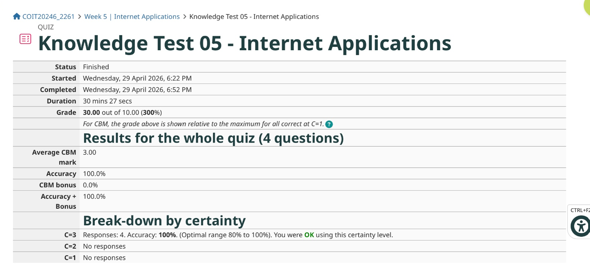
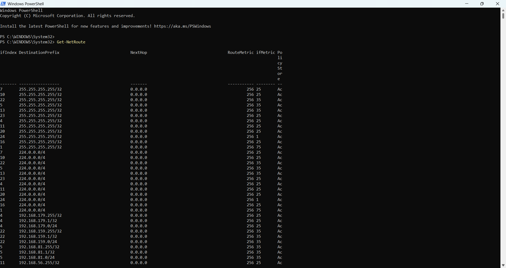
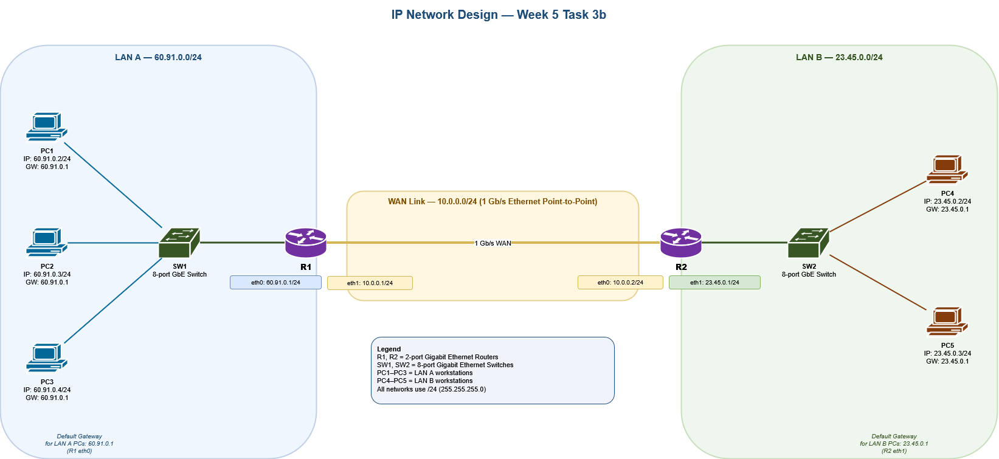
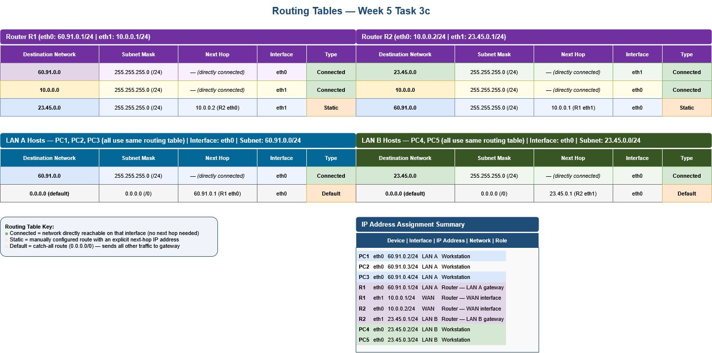
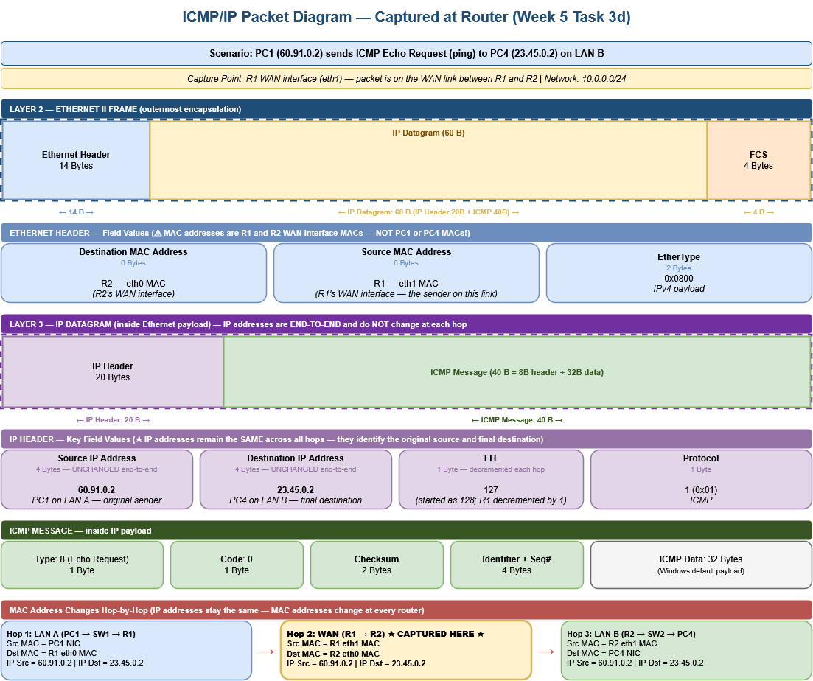
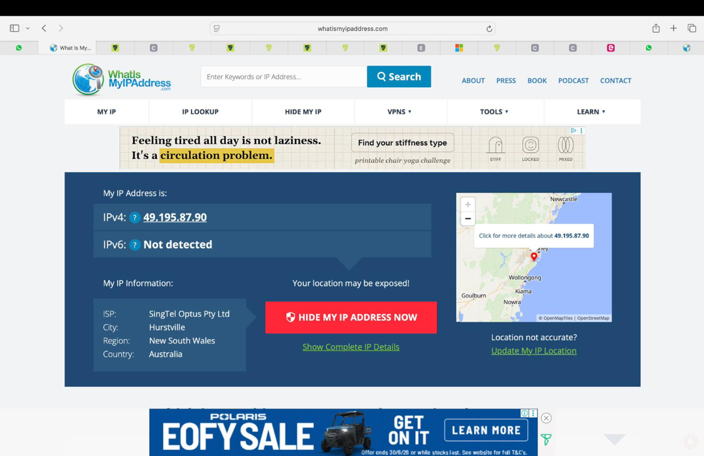
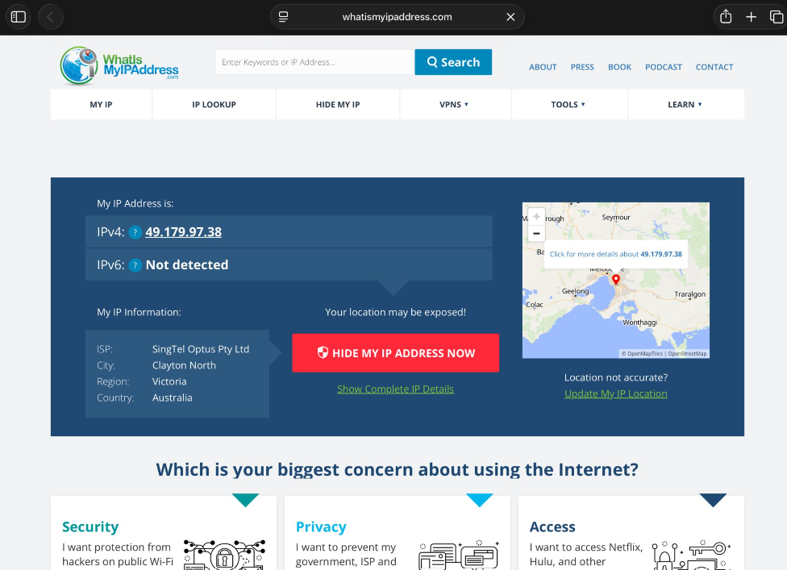

# Week 5 | Internetworking
Student Name: Akash Adhikary
Student ID: 12326091
Campus: Melbourne

---

## Task 1. Complete the Knowledge Test

I completed the Knowledge Test for Week 5 — Internetworking within the first 10 minutes of tutorial.

- **Grade:** 30.00 out of 10.00 (300%)
- **Accuracy:** 100%
- **CBM Bonus:** 0%
- **Average CBM Mark:** 3.00
- **Questions:** 5
- **Date Completed:** Thursday, 16 April 2026



---

## Task 2. View Routing Table

I used the PowerShell command `Get-NetRoute` to view the full routing table for all network interfaces on my computer.

### Command Used

```powershell
Get-NetRoute
```

### Screenshot



### Description of Each Row

The `Get-NetRoute` output lists every route on every network adapter, grouped by destination prefix. The columns are: `ifIndex` (interface number), `DestinationPrefix` (destination network in CIDR), `NextHop` (the next router, or 0.0.0.0 if directly reachable), `RouteMetric` (cost of this route), `ifMetric` (cost of the interface), and `PolicyStore` (Ac = Active).

Most entries fall into five distinct types, each explained below.


#### Row Type 1 — `255.255.255.255/32` (Limited Broadcast), NextHop `0.0.0.0`

**Example:** `ifIndex 7 | 255.255.255.255/32 | 0.0.0.0 | RouteMetric 256 | ifMetric 25 | Ac`

**Reading:** "Any packet sent to the limited broadcast address 255.255.255.255 on interface 7 is delivered to all hosts on that local segment — no router is involved (NextHop 0.0.0.0 = send directly on this interface)."

This entry appears on every active interface because any device may need to send a broadcast. The `256` route metric is the Windows default for auto-assigned routes.


#### Row Type 2 — `224.0.0.0/4` (IPv4 Multicast Range), NextHop `0.0.0.0`

**Example:** `ifIndex 7 | 224.0.0.0/4 | 0.0.0.0 | RouteMetric 256 | ifMetric 25 | Ac`

**Reading:** "Any packet destined for an IPv4 multicast address (224.0.0.0 through 239.255.255.255) on interface 7 is forwarded directly on that segment without a router."

The `/4` prefix covers the entire Class D multicast range. Like the broadcast entry, every active interface gets one of these so protocols such as IGMP (224.0.0.22), mDNS (224.0.0.251), and SSDP (239.255.255.250) can operate on each adapter.


#### Row Type 3 — Subnet Network Route `192.168.x.0/24`, NextHop `0.0.0.0`

**Example:** `ifIndex 4 | 192.168.179.0/24 | 0.0.0.0 | RouteMetric 256 | ifMetric 25 | Ac`

**Reading:** "To reach any host on the 192.168.179.0/24 network, send the packet directly out through interface 4 — no router hop is needed because this network is directly connected."

Similar rows appear for all virtual and physical adapters:

| Interface | Subnet | Adapter |
|-----------|--------|---------|
| ifIndex 4 | 192.168.179.0/24 | VMware Ethernet 3 |
| ifIndex 22 | 192.168.159.0/24 | VMware VMnet8 (NAT) |
| ifIndex 5 | 192.168.81.0/24 | VMware VMnet1 (Host-Only) |
| ifIndex 11 | 192.168.56.0/24 | VirtualBox Host-Only |


#### Row Type 4 — Host Route `192.168.x.1/32`, NextHop `0.0.0.0`

**Example:** `ifIndex 4 | 192.168.179.1/32 | 0.0.0.0 | RouteMetric 256 | ifMetric 25 | Ac`

**Reading:** "Packets addressed to exactly 192.168.179.1 (the interface's own IP address) are handled locally on interface 4 — this is a /32 host route that keeps traffic destined for the machine's own address on the local stack."


#### Row Type 5 — Subnet Directed Broadcast `192.168.x.255/32`, NextHop `0.0.0.0`

**Example:** `ifIndex 4 | 192.168.179.255/32 | 0.0.0.0 | RouteMetric 256 | ifMetric 25 | Ac`

**Reading:** "Any packet sent to the directed broadcast address 192.168.179.255 is delivered to all hosts on the 192.168.179.0/24 subnet via interface 4, without involving a router."


#### Additional Notable Routes (below visible area in screenshot)

The routing table also contains the following important entries that are partially or fully below the visible scroll area of the screenshot:

| Destination | NextHop | Interface | Description |
|------------|---------|-----------|-------------|
| `0.0.0.0/0` | `192.168.1.1` | Wi-Fi (ifIndex 13) | **Default route** — all traffic not matched by a more specific route is forwarded to the home router (default gateway) |
| `192.168.1.0/24` | `0.0.0.0` | Wi-Fi (ifIndex 13) | Directly connected home Wi-Fi subnet |
| `192.168.1.170/32` | `0.0.0.0` | Wi-Fi (ifIndex 13) | Host route for the computer's own Wi-Fi IP |
| `127.0.0.0/8` | `0.0.0.0` | Loopback (ifIndex 1) | Loopback interface — all 127.x.x.x traffic stays on the local machine |
| `10.10.10.0/24` | `0.0.0.0` | Ethernet (ifIndex 15) | Directly connected static Ethernet segment |

---

## Task 3. IP Network Design

*This task was completed collaboratively with my project group. Group member: [Partner Name — Student ID]*

---

### Part a) IP Address Selection and Assignment

**IP addressing rule:**
- Student ID `12326091` → last 4 digits = **6091** → **LAN A: 60.91.0.0/24**
- Partner ID → last 4 digits = **2345** → **LAN B: 23.45.0.0/24**
- WAN (point-to-point): **10.0.0.0/24** (chosen freely)

All three networks use a **/24 subnet mask** (255.255.255.0) as required.

#### Device and IP Address Table

| Device | Interface | IP Address | Subnet Mask | Network | Role |
|--------|-----------|------------|-------------|---------|------|
| **PC1** | eth0 | 60.91.0.2 | 255.255.255.0 | LAN A | Workstation |
| **PC2** | eth0 | 60.91.0.3 | 255.255.255.0 | LAN A | Workstation |
| **PC3** | eth0 | 60.91.0.4 | 255.255.255.0 | LAN A | Workstation |
| **R1** | eth0 | 60.91.0.1 | 255.255.255.0 | LAN A | Default gateway for LAN A |
| **R1** | eth1 | 10.0.0.1 | 255.255.255.0 | WAN | WAN interface toward R2 |
| **R2** | eth0 | 10.0.0.2 | 255.255.255.0 | WAN | WAN interface toward R1 |
| **R2** | eth1 | 23.45.0.1 | 255.255.255.0 | LAN B | Default gateway for LAN B |
| **PC4** | eth0 | 23.45.0.2 | 255.255.255.0 | LAN B | Workstation |
| **PC5** | eth0 | 23.45.0.3 | 255.255.255.0 | LAN B | Workstation |

**Default gateways:** PC1–PC3 use `60.91.0.1` (R1 eth0). PC4–PC5 use `23.45.0.1` (R2 eth1).

---

### Part b) Network Diagram

The diagram below shows all five PCs, two 8-port Gigabit Ethernet switches (SW1, SW2), two 2-port routers (R1, R2), and the three IP networks clearly labelled with interface addresses.




---

### Part c) Routing Tables

The routing tables for all devices are shown below. The simplified format matches the Internetworking lecture slides.




#### Summary of routing tables (text format)

**Router R1** — has two interfaces and knows all three networks:

| Destination Network | Subnet Mask | Next Hop | Interface | Type |
|---------------------|-------------|---------|-----------|------|
| 60.91.0.0 | 255.255.255.0 | — (directly connected) | eth0 | Connected |
| 10.0.0.0 | 255.255.255.0 | — (directly connected) | eth1 | Connected |
| 23.45.0.0 | 255.255.255.0 | 10.0.0.2 (R2 eth0) | eth1 | Static |

**Router R2** — symmetric to R1:

| Destination Network | Subnet Mask | Next Hop | Interface | Type |
|---------------------|-------------|---------|-----------|------|
| 23.45.0.0 | 255.255.255.0 | — (directly connected) | eth1 | Connected |
| 10.0.0.0 | 255.255.255.0 | — (directly connected) | eth0 | Connected |
| 60.91.0.0 | 255.255.255.0 | 10.0.0.1 (R1 eth1) | eth0 | Static |

**LAN A Hosts (PC1, PC2, PC3)** — all identical:

| Destination Network | Subnet Mask | Next Hop | Interface | Type |
|---------------------|-------------|---------|-----------|------|
| 60.91.0.0 | 255.255.255.0 | — (directly connected) | eth0 | Connected |
| 0.0.0.0 | 0.0.0.0 | 60.91.0.1 (R1 eth0) | eth0 | Default |

**LAN B Hosts (PC4, PC5)** — all identical:

| Destination Network | Subnet Mask | Next Hop | Interface | Type |
|---------------------|-------------|---------|-----------|------|
| 23.45.0.0 | 255.255.255.0 | — (directly connected) | eth0 | Connected |
| 0.0.0.0 | 0.0.0.0 | 23.45.0.1 (R2 eth1) | eth0 | Default |

---

### Part d) ICMP Packet Diagram — Captured at Router

**Scenario:** PC1 (`60.91.0.2`) on LAN A sends an ICMP Echo Request (ping) to PC4 (`23.45.0.2`) on LAN B. The packet is captured at **R1's WAN interface (eth1)** as it travels across the WAN link from R1 to R2.




#### Addresses in the Packet

**IP addresses (end-to-end, unchanged across all hops):**

| Field | Value | Reason |
|-------|-------|--------|
| Source IP | 60.91.0.2 | PC1 on LAN A — original sender |
| Destination IP | 23.45.0.2 | PC4 on LAN B — final destination |
| TTL | 127 | Started at 128 (Windows default); decremented by 1 when R1 forwarded the packet |
| Protocol | 1 (ICMP) | Payload is an ICMP message |

**MAC addresses (change at every router hop — only valid within one link):**

At the capture point (R1 WAN interface, on the WAN link to R2):

| Field | Value |
|-------|-------|
| Source MAC | R1 eth1 MAC address |
| Destination MAC | R2 eth0 MAC address |

The MAC addresses in the Ethernet frame at this capture point are those of the **two router WAN interfaces** — not PC1 or PC4. This is because MAC addresses only operate within a single Layer 2 segment. When R1 forwarded the packet, it stripped the original Ethernet frame (which had PC1's MAC as source and R1-eth0's MAC as destination on LAN A) and created a new Ethernet frame with R1-eth1 as source and R2-eth0 as destination for the WAN link.

#### Hop-by-hop MAC address summary

| Segment | Source MAC | Destination MAC | IP Src | IP Dst |
|---------|------------|-----------------|--------|--------|
| Hop 1 — LAN A (PC1 → SW1 → R1) | PC1 NIC | R1 eth0 | 60.91.0.2 | 23.45.0.2 |
| **Hop 2 — WAN (R1 → R2) ★ Captured here ★** | **R1 eth1** | **R2 eth0** | **60.91.0.2** | **23.45.0.2** |
| Hop 3 — LAN B (R2 → SW2 → PC4) | R2 eth1 | PC4 NIC | 60.91.0.2 | 23.45.0.2 |

The key lesson here is that **IP addresses stay the same end-to-end** (they identify the original source and final destination), while **MAC addresses change at every router** because they only identify the devices on each individual link.

---

## Task 4. Academic Integrity Outcomes

*Conducted as a group discussion during the tutorial. I summarised the most interesting scenario below.*

### Selected Scenario

The scenario our group found most interesting and most likely to be relevant was: *A student who was struggling with time pressure during the term found a completed assignment from a student who had taken the same unit in a previous semester and submitted it with minor wording changes, believing it would not be detected.*

### a) What Could the Student Have Done Differently?

The student could have:
1. **Started the assessment earlier** to avoid the time crunch that led to the decision
2. **Visited the tutor during consultation hours** to ask for guidance on the parts they were struggling with — tutors are there specifically to help
3. **Used the university's Academic Learning Centre** for writing and study support
4. **Applied for an extension** if genuine personal circumstances were affecting their ability to complete the work on time — this is a legitimate option that many students overlook

### b) Level of Breach and CQU Policy Outcome

This scenario constitutes a **Level 3 — Significant Breach** of academic integrity under the CQU Student Academic Integrity Policy and Procedure. Submitting another student's work as one's own is plagiarism, and reusing a prior student's assessment adds the element of contract/collusion even if the other party is unaware.

**Likely outcome according to CQU policy:** A grade of zero for the assessment and possible escalation to a grade of zero for the entire unit. The incident is recorded on the student's academic integrity file.

**Is the outcome fair to the student?** Our group was divided. Some felt it was harsh given genuine stress, but ultimately agreed that fairness cannot be assessed in isolation — the assessment was supposed to measure that individual student's knowledge and skills, and submitting someone else's work misrepresents that entirely.

**Is it fair to students who studied hard?** No. Students who invest time and effort to produce original work are disadvantaged when grades are awarded to work that was not genuinely their own. The strict consequence protects the value of every other student's honest grade.

### c) Future Ramifications if Not Caught

If a student performs academic misconduct and is not detected during the term:
1. **Competency gaps** — They earn a qualification without developing the skills the unit was designed to build. In a computing and networking career, these gaps can directly affect job performance and create safety/security risks in real systems.
2. **Risk of later detection** — University systems regularly improve plagiarism detection. Work submitted now can be retrospectively compared against growing databases. Detection years later can result in degree revocation.
3. **Professional reputation** — If misconduct surfaces after graduation, it can invalidate professional certifications and damage career prospects permanently.
4. **Impact on others** — It devalues the degree for every other graduate of that program.

### Two Recommendations to Other Students

1. **Use time management tools from week one.** Set personal deadlines 3–4 days before the actual due date. This buffer turns last-minute crises into manageable situations and removes the pressure that drives poor decisions.
2. **Ask for help early and legitimately.** Tutors, learning support services, and study groups are all legitimate resources. The moment you feel stuck, reach out — it is always better to ask for an extension or support than to make a decision that can follow you for the rest of your career.

---

## Task 5. IP Address Lookup (Homework)

I used the website **whatismyipaddress.com** to look up my public IP address from two different networks — my home Wi-Fi (SingTel Optus connection) and my campus data connection.

### Test 1 — Home Wi-Fi (SingTel Optus)



| Field | Result |
|-------|--------|
| Public IP shown | 49.195.87.90 (ISP's public IP — not my laptop's 192.168.1.170) |
| Location identified | Hurstville, New South Wales, Australia |
| ISP identified | SingTel Optus Pty Ltd |
| Accuracy | City level — not street address or suburb |

### Test 2 — Campus (SingTel Optus Pty Ltd)



| Field | Result |
|-------|--------|
| Public IP shown | 49.179.97.38 (ISP's carrier IP — completely different from home IP) |
| Location identified | Clayton North, Victoria, Australia |
| ISP identified | SingTel Optus Pty Ltd |
| Accuracy | City level only — approximate |

### Analysis

**What is actually identified?**

The IP address lookup websites do **not** identify my computer's IP address. My laptop's actual IP on the home network is `192.168.1.170` — a private, non-routable address that only exists inside my home network. The website instead sees the **public IP address of my home router** as assigned by my ISP (SingTel Optus). This is because my home router uses **NAT (Network Address Translation)** to share a single public IP address across all devices on the network.

On the campus network, the same principle applies — my device sits behind the campus network infrastructure, and the outside world sees the ISP's carrier-assigned public IP (`49.179.97.38`) rather than any private address assigned to my device.

**How accurate is the location?**

Both tests identified the city and country correctly, but neither identified my specific suburb, street, or building. Test 1 (home Wi-Fi) resolved to Hurstville, New South Wales, while Test 2 (campus) resolved to Clayton North, Victoria — even though both connections are on the same ISP (SingTel Optus). This demonstrates that geolocation is based on where the ISP **registered** the IP address block, not the actual physical location of the device. The result can be several kilometres — or even a different city — away from where the user actually is.

**Why does the IP change between home and campus?**

Although both networks use SingTel Optus as the ISP, they are separate network connections drawing from different pools of public IP addresses within Optus's allocation. Home Wi-Fi assigned `49.195.87.90`, while the campus data connection assigned `49.179.97.38`. Each connection is behind its own NAT system, so a different public IP is presented to the internet. This confirms that even within the same ISP, IP addresses are dynamically assigned and tied to the specific access point or region — not to the user or device.

**Why can't the MAC address be found?**

Like the exercise in Week 4 (Task 7), the MAC address of my device or router cannot be found by these tools. MAC addresses are Layer 2 addresses and only travel within local network segments. By the time traffic exits the home router or campus gateway and reaches the internet, Ethernet frames are entirely rebuilt at each hop — the original MAC address is never transmitted across network boundaries and is therefore invisible to any external lookup tool.

---
s