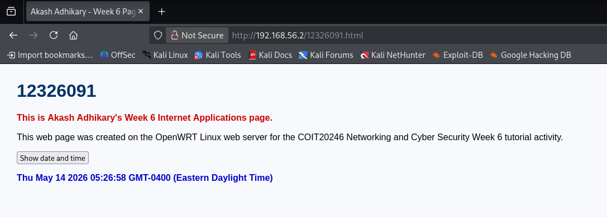
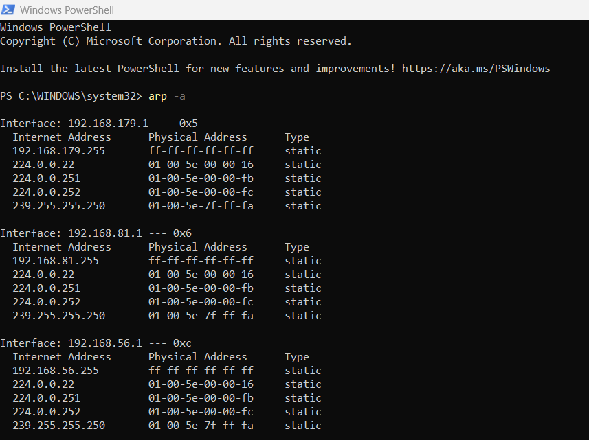
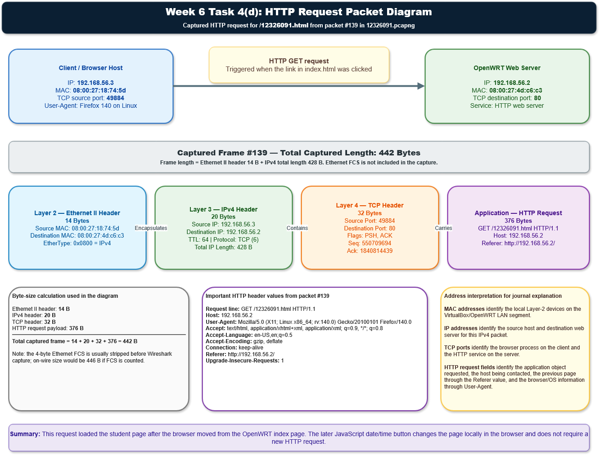

# Week 6 | Internet Applications
Student Name: Akash Adhikary  
Student ID: 12326091  
Campus: Melbourne

---

## Task 1. Complete the Knowledge Test

I completed the Week 6 Knowledge Test for **Internet Applications** during the tutorial session.


---

## Task 2. Create Web Pages in OpenWRT

For this task, I created and tested a simple website on the OpenWRT Linux web server. The web server was accessed at:

```text
http://192.168.56.2/
```

The files were stored in the OpenWRT web directory and included the required home page, student page and external CSS stylesheet.

### Files Created 

| File | Purpose |
|---|---|
| `index.html` | Main OpenWRT home page containing a hyperlink to my student page |
| `12326091.html` | Student web page showing my student ID, name, course, task information and JavaScript date/time button |
| `mystyle.css` | External CSS file used to format the web page text and colours |

### Web Page Output

The screenshot below shows my student web page after the **Show date and time** button was pressed. The page clearly displays my student ID, name and the locally generated browser date/time result.



### Short Explanation

The page demonstrates three basic Internet application concepts. First, the browser requests the HTML document from the OpenWRT web server using HTTP. Second, the HTML file links to an external CSS file, so the browser also requests the stylesheet and applies the formatting. Third, the date/time button uses JavaScript in the browser, so the displayed time is generated locally without needing a new server request.

---

## Task 3. Capture HTTP Packets

I captured HTTP traffic while accessing the OpenWRT web page and my student page. The packet capture file submitted for this task is:

```text
week6-http-12326091.pcapng
```

The relevant browser interaction was:

1. Visit the OpenWRT web server at `http://192.168.56.2/`.
2. Open the link to `12326091.html`.
3. Press the **Show date and time** button.
4. Press the **Show date and time** button again.

### ARP Table Evidence

I also used the Windows `arp -a` command to view the ARP table.



### ARP Table Analysis

The ARP output shows static entries for several local interfaces, including `192.168.179.1`, `192.168.81.1` and `192.168.56.1`. The static entries include broadcast and multicast mappings such as `192.168.x.255`, `224.0.0.22`, `224.0.0.251`, `224.0.0.252` and `239.255.255.250`. These entries are normal because Windows permanently maps broadcast and multicast IPv4 addresses to their corresponding Layer 2 MAC addresses.

No dynamic OpenWRT entry is visible in this ARP screenshot. This can occur because ARP cache entries expire quickly when they are not used, and the HTTP packet capture shows the active HTTP client as `192.168.56.3` while the OpenWRT server is `192.168.56.2`. Therefore, the ARP table screenshot is still useful because it confirms the host-only interface exists, but the HTTP packet capture gives the stronger evidence for the client-to-server communication path.

---

## Task 4. Analyse HTTP Packet Capture

I opened `week6-http-12326091.pcapng` in Wireshark and filtered the capture using:

```text
http
```

The HTTP traffic shows the browser requesting the OpenWRT home page, the CSS stylesheet, the student HTML page and the stylesheet again after the student page loaded.

### a) Explanation of HTTP Requests and Responses

| Packet(s) | HTTP Message | Explanation |
|---:|---|---|
| 4 | `GET / HTTP/1.1` | The browser requested the OpenWRT home page from `192.168.56.2`. This was triggered when the server root URL was opened. |
| 6 and 8 | `HTTP/1.1 200 OK` plus response body | The OpenWRT server accepted the request and returned the home page content. The response was split across multiple TCP segments. |
| 10 | `GET /mystyle.css HTTP/1.1` | The browser requested the external stylesheet because the home page referenced `mystyle.css`. |
| 11 and 13 | `HTTP/1.1 200 OK` plus response body | The server returned the CSS file successfully so the browser could apply the page styling. |
| 139 | `GET /12326091.html HTTP/1.1` | The browser requested my student page after the link in `index.html` was selected. This is the main HTTP request used for the packet diagram. |
| 140, 142, 144 and 146 | `HTTP/1.1 200 OK` plus page content | The OpenWRT server successfully returned the student HTML page, with the response content split over several TCP segments. |
| 148 | `GET /mystyle.css HTTP/1.1` | The browser requested the stylesheet again because `12326091.html` also links to `mystyle.css`. |
| 149 | `HTTP/1.1 304 Not Modified` | The server indicated that the browser's cached CSS version was still current, so the full CSS file did not need to be sent again. |

### b) Five Address Values for the First HTTP Request/Response

For the first HTTP request in packet 4, the following address values identify the host, transport protocol and application context:

| Layer | Field | Value |
|---|---|---|
| Network | Source IP address | `192.168.56.3` |
| Network | Destination IP address | `192.168.56.2` |
| Transport | TCP source port | `49884` |
| Transport | TCP destination port | `80` |
| Application | HTTP host/request | `Host: 192.168.56.2`, request line `GET / HTTP/1.1` |

These five values show that the browser client at `192.168.56.3` contacted the OpenWRT web server at `192.168.56.2` using HTTP over TCP port 80.

### c) Did Clicking the Date/Time Button Send a New HTTP Request?

Clicking the **Show date and time** button did **not** send a new request to the OpenWRT web server. The button uses JavaScript already loaded inside the HTML page. When the button is clicked, the browser executes the local `Date()` function and changes the content of the page element in the browser. This is why the packet capture does not show a separate HTTP request for the two date/time button clicks.

### d) Packet Diagram of the HTTP Request for `12326091.html`

The diagram below represents packet **#139**, which is the HTTP request for my student page.



Files uploaded:

```text
week6-task4-http-packet.png
week6-task4-http-packet.drawio
```

### Packet #139 Header and Size Details

| Component | Size | Key Values |
|---|---:|---|
| Ethernet II header | 14 bytes | Source MAC `08:00:27:18:74:5d`, destination MAC `08:00:27:4d:c6:c3`, EtherType `0x0800` |
| IPv4 header | 20 bytes | Source IP `192.168.56.3`, destination IP `192.168.56.2`, TTL `64`, protocol TCP `6`, total IP length `428` bytes |
| TCP header | 32 bytes | Source port `49884`, destination port `80`, flags `PSH, ACK` |
| HTTP request payload | 376 bytes | `GET /12326091.html HTTP/1.1`, host `192.168.56.2` |
| Total captured frame | 442 bytes | `14 + 20 + 32 + 376 = 442` bytes |

The 4-byte Ethernet Frame Check Sequence is normally stripped before packet capture, so it is not included in the Wireshark captured frame length. If it were counted on the wire, the frame would be 446 bytes.

### e) Referrer Value and Meaning

For packet #139, the referrer value is:

```text
Referer: http://192.168.56.2/
```

This identifies the previous page that linked to the requested resource. In this case, it shows that the browser moved from the OpenWRT home page to `12326091.html`. Web servers can use this field for access logging, navigation analysis, usage analytics and troubleshooting broken or unexpected page transitions.

### f) Browser Information Learned by the Server

The HTTP request contains this `User-Agent` value:

```text
Mozilla/5.0 (X11; Linux x86_64; rv:140.0) Gecko/20100101 Firefox/140.0
```

This tells the web server that the browser was Firefox 140 running on a Linux x86_64 system. The server also learned supported content types from the `Accept` header, language preference from `Accept-Language`, compression support from `Accept-Encoding`, and that the browser requested an insecure HTTP page upgrade preference through `Upgrade-Insecure-Requests`.

### g) HTTP Version and Transport Protocol

The capture used **HTTP/1.1** as the application-layer protocol and **TCP** as the transport-layer protocol. TCP destination port `80` identifies the server-side HTTP service.

### h) TCP Connection Setup and Time to First Data Transfer

The connection-oriented TCP setup occurred before the first HTTP request:

| Packet | Time from start | Direction | TCP Flags | Meaning |
|---:|---:|---|---|---|
| 1 | `0.000000 s` | `192.168.56.3:49884` → `192.168.56.2:80` | SYN | Client requested a TCP connection |
| 2 | `0.001229 s` | `192.168.56.2:80` → `192.168.56.3:49884` | SYN, ACK | Server accepted and acknowledged the request |
| 3 | `0.001277 s` | `192.168.56.3:49884` → `192.168.56.2:80` | ACK | Client confirmed the connection |
| 4 | `0.001453 s` | `192.168.56.3:49884` → `192.168.56.2:80` | PSH, ACK | First HTTP data transfer began |

The time from the first SYN packet to the first HTTP data packet was approximately:

```text
0.001453 seconds = 1.453 milliseconds
```

This short setup time is expected because the client and server were on the same VirtualBox host-only network.

### i) TCP Acknowledgements

TCP acknowledgements are visible through packets with the ACK flag set. Examples in this capture include packets **3, 5, 7, 9, 12, 14, 141, 143, 145, 147 and 150**. Acknowledgements are sent during connection setup, after receiving data, and while maintaining reliable delivery. Their purpose is to confirm successful receipt of TCP segments so that lost or missing data can be retransmitted if required.

---

## Task 5. View Your Cookies

I used browser developer tools to inspect the cookies stored by a regularly visited website. Because cookie values may contain private session identifiers, I did not include exact cookie values in the journal.

### Types of Cookie Information Observed

| Cookie Information Type | Explanation |
|---|---|
| Session identifiers | Used to recognise a browser session after login or during browsing |
| Preference data | Stores language, display, region or site preference settings |
| Analytics identifiers | Helps websites understand visit frequency and page navigation behaviour |
| Security attributes | Includes flags such as `Secure`, `HttpOnly` and `SameSite` to reduce cookie misuse |
| Expiry information | Controls whether the cookie is temporary or stored for a longer period |
| Domain and path scope | Defines which website domain and page path can access the cookie |

### Privacy Reflection

Cookies can improve convenience by keeping users logged in and remembering preferences, but they can also reveal browsing behaviour if used for analytics or tracking. For this reason, cookie values should not be shared publicly in screenshots or journal submissions. The safer approach is to describe the types of information stored rather than displaying sensitive token values.

---
