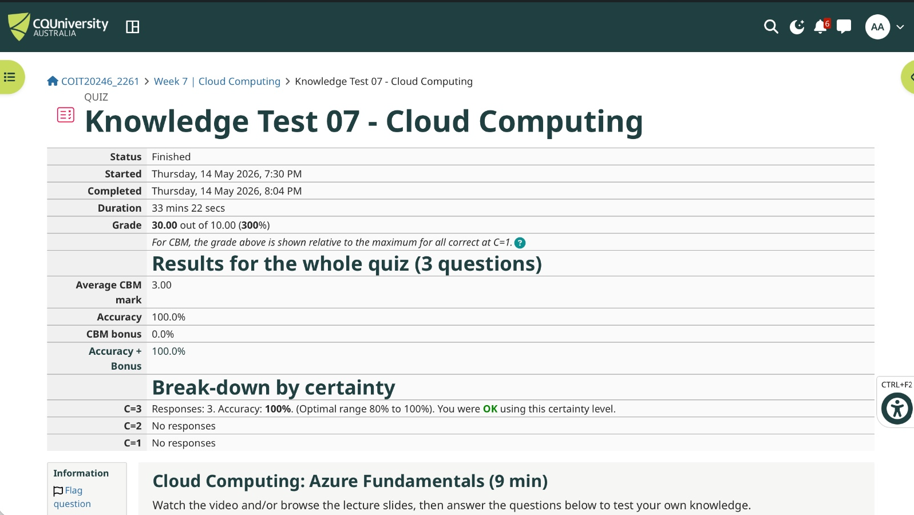
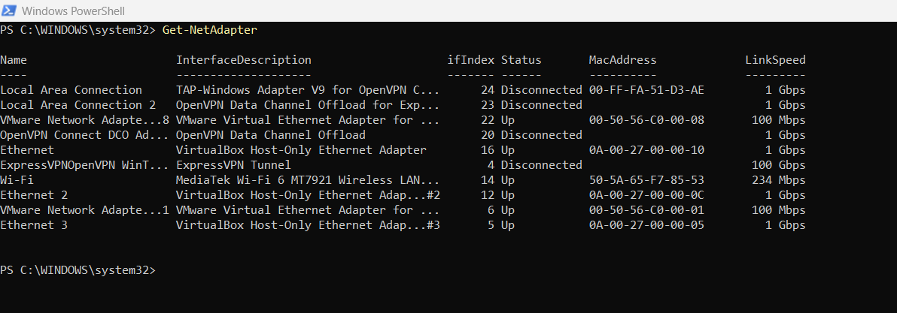
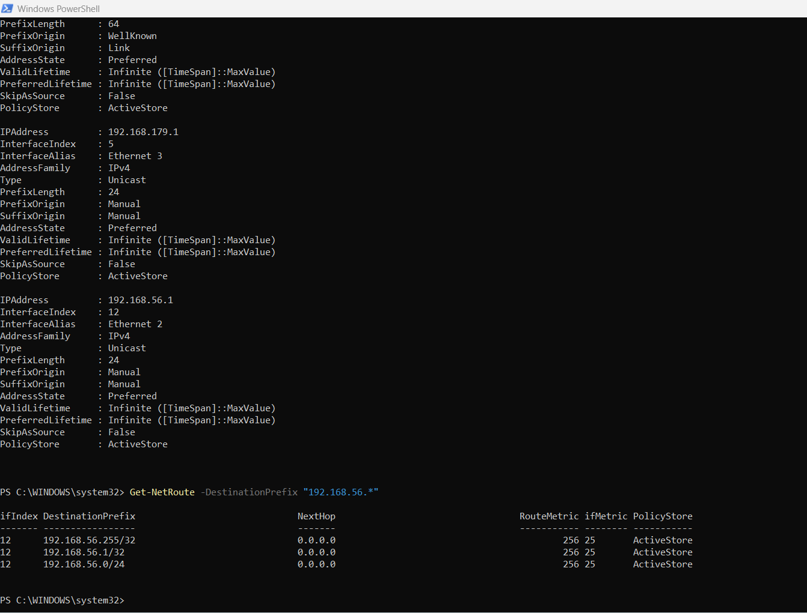
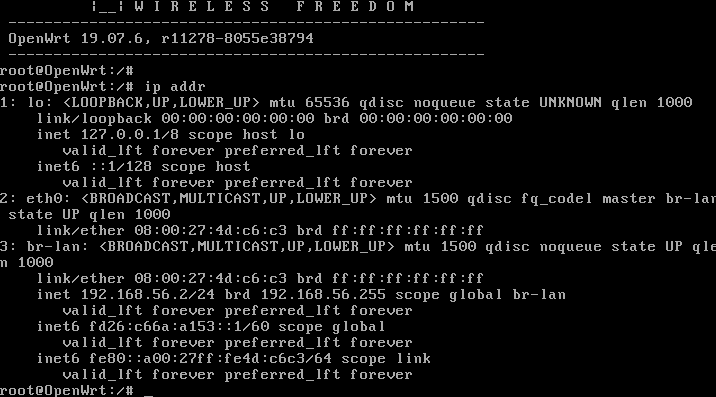
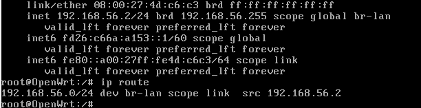
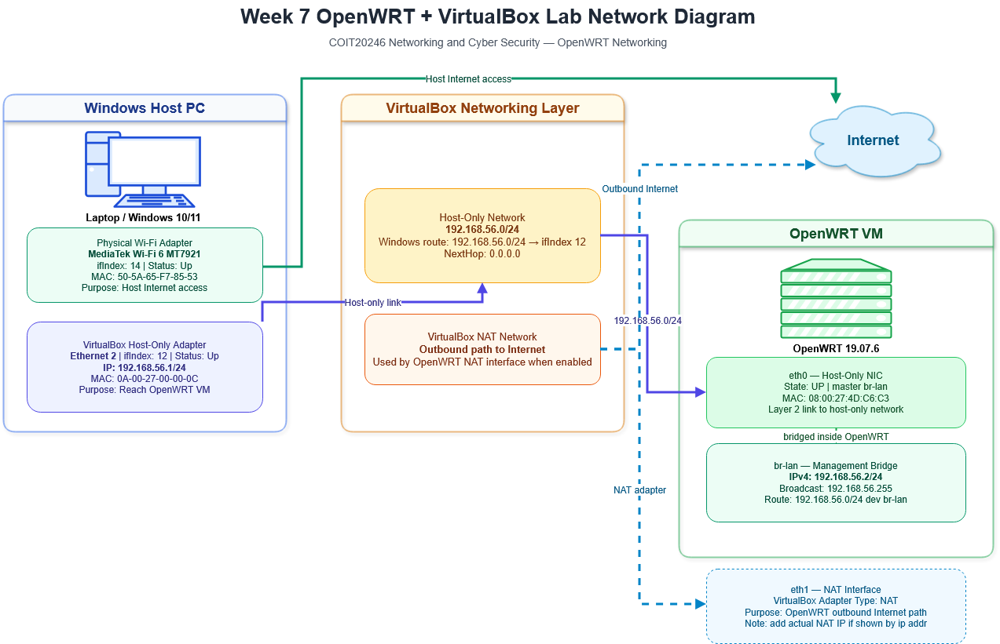
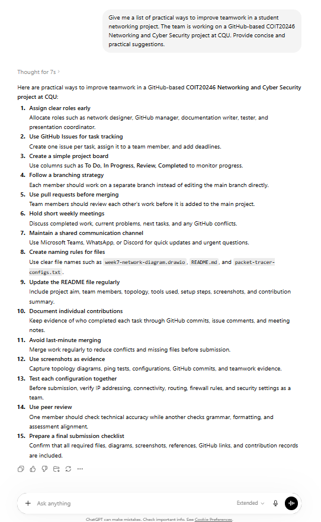

# Week 7 | OpenWRT Networking
Student Name: Akash Adhikary  
Student ID: 12326091  
Campus: Melbourne

---

## Task 1. Complete the Knowledge Test

I completed the Week 7 Knowledge Test for **OpenWRT Networking** during the tutorial session.



---

## Task 2. Review the Slides on OpenWRT and VirtualBox

I reviewed the OpenWRT and VirtualBox networking material during the tutorial. This task helped explain how the Windows host, VirtualBox host-only adapter, OpenWRT virtual interfaces and VirtualBox NAT networking interact.

There is no separate journal evidence required for this task.

---

## Task 3. Collecting Network Information

I collected network information from both the Windows host and the OpenWRT guest. The purpose was to identify how the host-only network allows the Windows host to reach OpenWRT, and how OpenWRT represents its network interfaces internally.

### 3.1 Windows Host Network Information

I first listed the Windows network adapters using:

```powershell
Get-NetAdapter
```



The key relevant adapter is **Ethernet 2**, which is the VirtualBox Host-Only adapter used to reach the OpenWRT virtual machine.

I then viewed the host-only adapter IP configuration and the route for the `192.168.56.0/24` network.



### 3.2 OpenWRT Guest Network Information

Inside OpenWRT, I used:

```bash
ip addr
```



I then viewed the OpenWRT routing table using:

```bash
ip route
```



### 3.3 Network Information Table

| Device | Interface | IP Address | VirtualBox Adapter Type | Purpose |
|---|---|---|---|---|
| Windows Host PC | Wi-Fi adapter | Physical/external network IP not required for OpenWRT access | Physical network adapter | Provides the host computer's normal Internet connectivity |
| Windows Host PC | `Ethernet 2` — VirtualBox Host-Only Ethernet Adapter #2 | `192.168.56.1/24` | Host-Only | Allows the Windows host to communicate with OpenWRT on the `192.168.56.0/24` lab network |
| Windows Host PC | Route to `192.168.56.0/24` | Next hop `0.0.0.0`, interface index `12` | Host-Only route | Shows that Windows sends traffic for the OpenWRT network directly through the host-only adapter |
| OpenWRT VM | `eth0` | No separate IPv4 shown directly on `eth0`; it is part of `br-lan` | Host-Only NIC | Physical virtual NIC connected to the host-only network |
| OpenWRT VM | `br-lan` | `192.168.56.2/24` | OpenWRT bridge over host-only NIC | Main management bridge used for web/SSH access to OpenWRT |
| OpenWRT VM | `lo` | `127.0.0.1/8` | Loopback | Local internal communication inside OpenWRT |
| OpenWRT VM | Default route | Not visible in the provided `ip route` output | NAT route not shown | The screenshot only shows the directly connected route `192.168.56.0/24 dev br-lan src 192.168.56.2` |

### Interpretation

The Windows output confirms that the VirtualBox host-only adapter `Ethernet 2` has IP address `192.168.56.1/24`. The route table also confirms that traffic to `192.168.56.0/24` is sent through interface index `12`, which matches the host-only adapter. This explains why the Windows host can access OpenWRT at `192.168.56.2`.

The OpenWRT output shows that `eth0` is active but bridged into `br-lan`. Therefore, the practical management IP address is not directly on `eth0`; it is assigned to `br-lan` as `192.168.56.2/24`. The route table shows a directly connected route for `192.168.56.0/24` through `br-lan`, confirming that the OpenWRT VM and Windows host are on the same host-only subnet.

---

## Task 4. Draw Network Diagram

I created a network diagram showing the Windows host, VirtualBox networking layer, OpenWRT virtual machine, host-only subnet and the Internet/NAT path.



Files uploaded:

```text
week7-task4-networkdiagram.png
week7-task4-networkdiagram.drawio
```

### Diagram Explanation

The diagram shows the Windows Host PC on the left, the VirtualBox networking layer in the centre, and the OpenWRT VM on the right. The important connection is the host-only network `192.168.56.0/24`, where Windows uses `192.168.56.1/24` and OpenWRT uses `192.168.56.2/24` on `br-lan`. This host-only link supports OpenWRT management, SSH access and web-server testing.

The diagram also includes a NAT/Internet path. In the provided OpenWRT screenshots, only the host-only route is visible, so the diagram labels the NAT path as an outbound path that is used when the NAT interface is enabled. This avoids incorrectly claiming that a default route was present in the shown routing table.

---

## Task 5. Self-Evaluation of Teamwork

As part of the group project, I used generative AI to identify practical ways to improve teamwork in a GitHub-based COIT20246 networking project. The screenshot below shows the prompt and generated output.



### AI Suggestions Considered

The AI output suggested several practical teamwork improvements, including assigning clear roles early, using GitHub issues, creating a simple project board, using branches, reviewing work before merging, holding short meetings, maintaining a shared communication channel, using consistent file names, documenting individual contributions, avoiding last-minute merging, and testing configurations together.

### Comparison with Our Current Teamwork

| Teamwork Area | Current Practice | Improvement Needed |
|---|---|---|
| Role allocation | We have divided project work informally across networking, documentation and GitHub tasks. | Roles should be written clearly in the project repository so each member knows their responsibility. |
| GitHub repository use | The team is using GitHub as the shared project location. | Commit messages should be more specific, such as `added OpenWRT network diagram` rather than vague messages like `update`. |
| Communication | The team communicates about tasks and progress. | Important decisions should also be recorded in GitHub issues, README notes or meeting minutes. |
| File naming | Weekly files and images are generally named by task number. | The whole team should follow one naming convention for diagrams, screenshots, configuration files and report sections. |
| Peer review | Some checking occurs before submission. | Each configuration, diagram and written section should be checked by at least one other member before final upload. |
| Time management | Work is completed progressively during weekly tutorials. | Final merging should occur 2–3 days before submission to avoid missing screenshots, broken links or conflicts. |

### GitHub Contributors Review

The Week 7 task requires a screenshot from:

```text
GitHub repository → Insights → Contributors
```

The screenshot should be saved as:

```text
images/week7-task5-github-contributors.png
```


### Reflection on Contribution

The GitHub Contributors page is useful because it gives visible evidence of each team member's commit activity. A balanced project should not rely on only one person committing most files. If one member has many more commits, it may show leadership and strong contribution, but it may also show that work is not being shared evenly. If one member has very few commits, they should contribute through clearer technical tasks, documentation tasks, screenshot collection or review comments.

For the remainder of the project, our team should improve by allocating tasks more formally, creating GitHub issues for unfinished work, using meaningful commit messages, testing each other's network configurations, and checking that all screenshots and diagrams match the final submitted files. This will make the project easier to mark because the repository will clearly show both technical progress and individual contribution.

