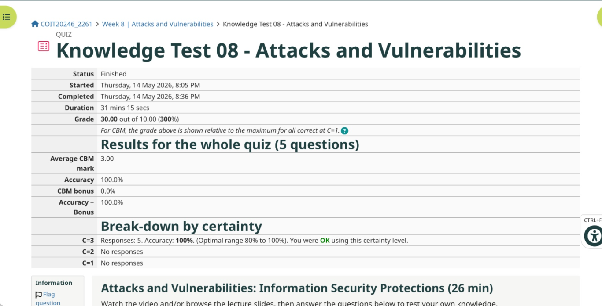
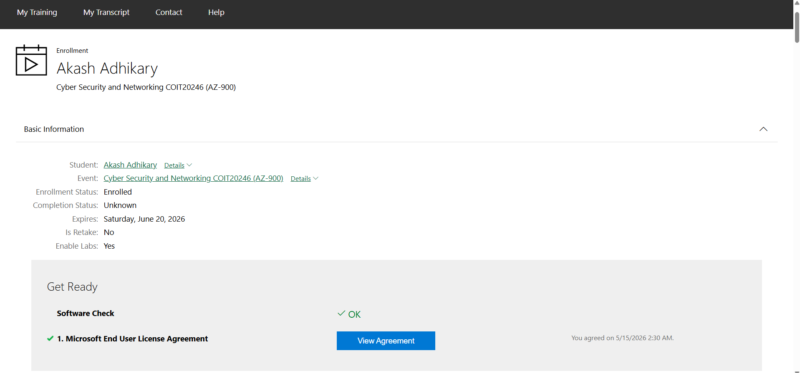
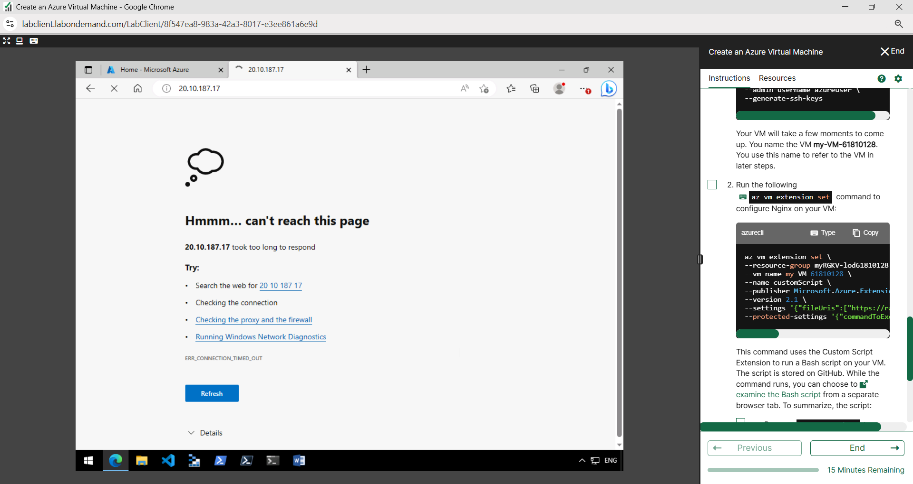
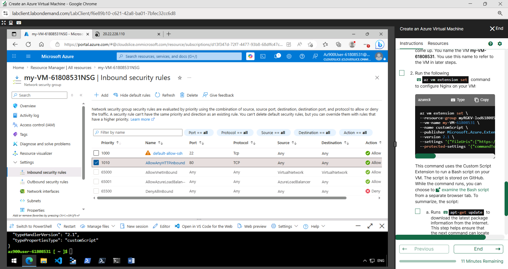
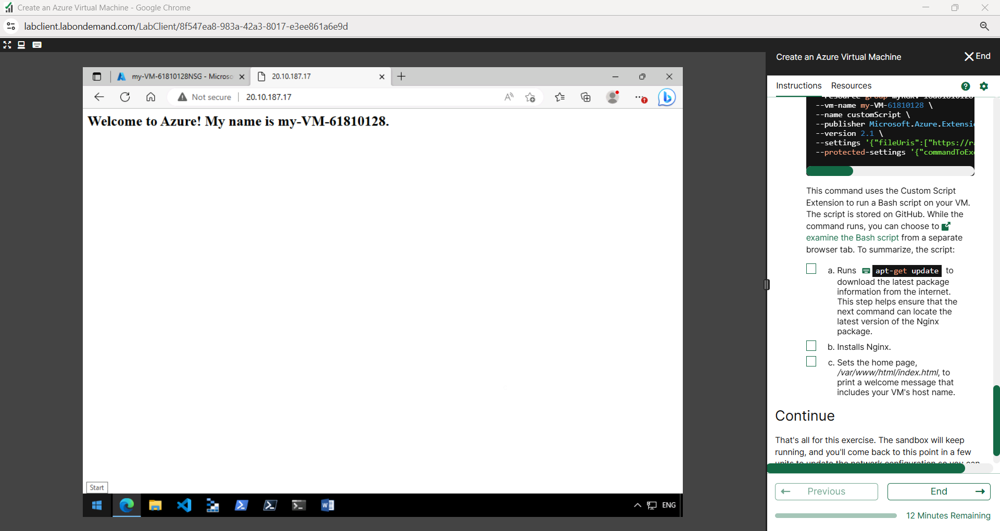
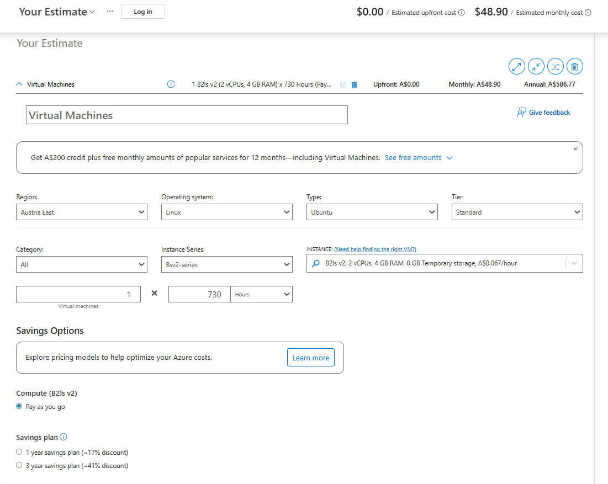
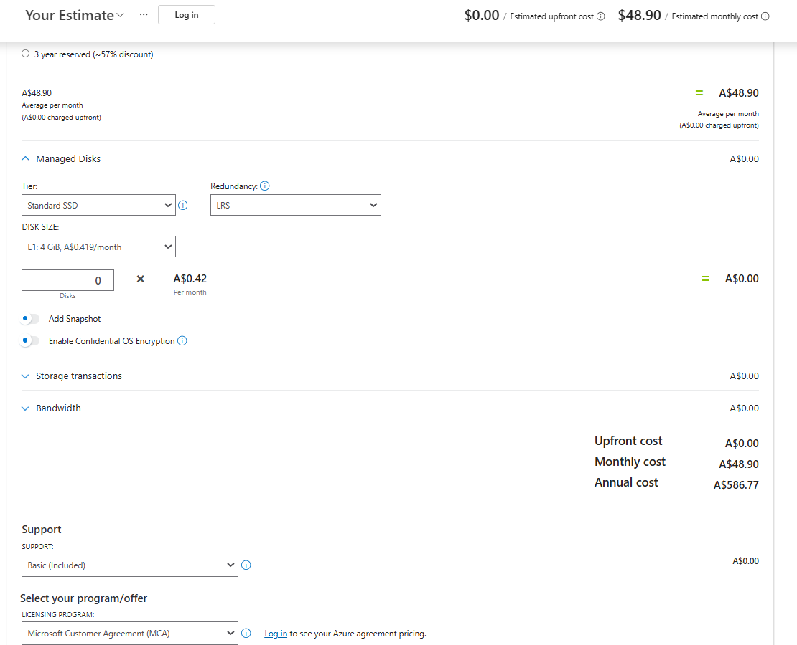
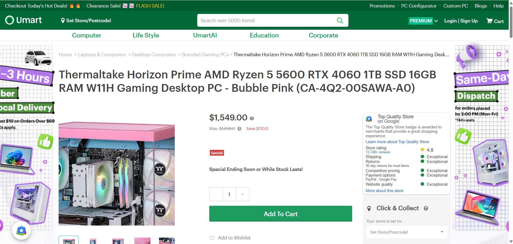

# Week 8 | Cloud Computing

**Student Name:** Akash Adhikary  
**Student ID:** 12326091  
**Campus:** Melbourne  

---

## Task 1. Complete the Knowledge Test

I completed the Week 8 Knowledge Test on **Attacks and Vulnerabilities** within the tutorial activity period.

- **Status:** Finished  
- **Grade:** 30.00 out of 10.00 (300%)  
- **Accuracy:** 100%  
- **Average CBM Mark:** 3.00  
- **Questions:** 5  
- **Date Completed:** Thursday, 14 May 2026  



---

## Task 2. Login to Microsoft Learn on Demand

I logged into **Microsoft Learn on Demand / Skillable** using the temporary lab environment provided for COIT20246. The lab environment was used instead of a personal or CQU Microsoft Azure account, as required by the tutorial instructions. The screenshot below shows my enrolment in the **Cyber Security and Networking COIT20246 (AZ-900)** lab environment and confirms that the software check was successful.



---

## Task 3. Create an Azure Resource

I completed **Module 01: Create an Azure Resource** in Microsoft Learn on Demand. This task introduced the relationship between resource groups, Azure resources, and the Azure Portal. The key purpose of the task was to understand that cloud infrastructure is not a single physical computer, but a managed collection of resources created, grouped, configured, secured, monitored, and deleted through a cloud provider platform.

### Azure Resources Created / Used

| Resource | Purpose |
|---|---|
| **Resource Group** | A logical container used to organise the Azure lab resources. It allows the VM, network interface, public IP address, disk and security group to be managed together rather than as unrelated objects. |
| **Virtual Machine Resource** | The main compute resource used in the lab. It represents a cloud-hosted Ubuntu Linux server running inside Microsoft Azure infrastructure. |
| **Network Interface** | Connects the virtual machine to the Azure virtual network. It is the VM's virtual network card and is required for IP-based communication. |
| **Public IP Address** | Allows the VM to be reached from outside Azure. In this lab, the public IP address was used to access the Nginx web page through a browser. |
| **Network Security Group (NSG)** | Controls inbound and outbound network access to the VM. The NSG initially allowed SSH but did not allow HTTP until an inbound port 80 rule was added. |
| **Managed Disk** | Provides persistent storage for the Ubuntu operating system and files on the VM. It functions like the VM's cloud-hosted hard drive. |

### Explanation

This task demonstrated that Azure resources are modular and policy-controlled. A virtual machine depends on supporting resources such as a public IP address, network interface, storage disk, and security rules. The most important lesson was that a cloud server may exist and be running, but it is not automatically accessible from the internet unless the correct network security rules are configured.

---

## Task 4. Create an Azure Virtual Machine and Allow Web Access

I completed **Module 02: Create a Virtual Machine** using the Microsoft Learn on Demand lab environment. The virtual machine created in the lab was an Ubuntu VM running a web server. The public IP address used for browser testing was:

```text
20.10.187.17
```

The VM name visible in the lab was:

```text
my-VM-61810128
```

### Commands Used to Create the VM and Install Nginx

The lab used Azure CLI commands to create the VM and then install/configure the web server through a Custom Script extension. The commands below record the repeatable structure of the commands used in the exercise.

```bash
az vm create \
  --resource-group myRGKV-lod61810128 \
  --name my-VM-61810128 \
  --image Ubuntu2204 \
  --admin-username azureuser \
  --generate-ssh-keys
```

```bash
az vm extension set \
  --resource-group myRGKV-lod61810128 \
  --vm-name my-VM-61810128 \
  --name customScript \
  --publisher Microsoft.Azure.Extensions \
  --version 2.1 \
  --settings '{"commandToExecute":"sudo apt-get update && sudo apt-get install -y nginx && echo \"Welcome to Azure! My name is my-VM-61810128.\" | sudo tee /var/www/html/index.html"}'
```

To edit the page after deployment, I used the Ubuntu VM web directory:

```bash
sudo nano /var/www/html/index.html
```

The page was then updated to include my name.

---

### Initial Web Access Test — Connection Timed Out

Before allowing HTTP traffic, I tried to access the public IP address in the browser. The browser showed a timeout error because the VM's network security group did not yet permit inbound HTTP traffic on port 80.



This confirmed that the VM was not publicly reachable for web traffic even though it existed in Azure. The issue was not the browser or web server name; it was a cloud network security rule problem.

---

### Network Security Group Rule Added

I opened the VM's Network Security Group and added an inbound rule named **AllowAnyHTTPInbound**. The screenshot shows both the existing SSH rule and the new HTTP rule.



### Network Security Rules Allowing Access

| Rule Name | Port | Protocol | Source | Destination | Action | Explanation |
|---|---:|---|---|---|---|---|
| **default-allow-ssh** | 22 | TCP | Any | Any | Allow | Allows Secure Shell access to the Ubuntu VM. This enables the administrator to log in remotely using SSH and change server-side files such as `/var/www/html/index.html`. |
| **AllowAnyHTTPInbound** | 80 | TCP | Any | Any | Allow | Allows normal web browser traffic to reach the Nginx web server. Without this rule, the website times out even if the VM and Nginx service are running. |

---

### Successful Web Access After Adding Name

After adding the HTTP inbound rule and updating the page, the website loaded successfully from the public IP address. The final web page displayed:

```text
Welcome to Azure! My name is Akash Adhikary.
```



### Interpretation

This task showed the difference between **creating a cloud server** and **securely exposing a cloud service**. The VM could be deployed successfully, but the web page remained inaccessible until the NSG explicitly allowed inbound HTTP traffic. This is a core cloud security principle: access is controlled through network security policies, not simply by whether the server is running. SSH and HTTP also demonstrate different service purposes. SSH is for secure administration, while HTTP is for public web access.

---

## Task 5. Compare Cloud vs On-Premise Costs

For this task, I compared a cloud virtual machine from the Azure Pricing Calculator with a consumer desktop PC from a local Australian online store. The selected systems are not identical, but both represent practical compute options with enough resources for common student development, testing, and lightweight server workloads.

### Evidence Screenshots







### Cost and Specification Comparison

| Option | Provider / Source | CPU / Compute | Memory | Storage | Upfront Cost | Monthly Cost | 1-Year Cost | 3-Year Cost | Notes |
|---|---|---|---:|---|---:|---:|---:|---:|---|
| **Cloud Virtual Machine** | Microsoft Azure Pricing Calculator | B2ls v2, 2 vCPUs | 4 GB RAM | Azure estimate shown with no additional managed disk cost selected | A$0.00 | A$48.90 | A$586.77 | A$1,760.31 | Pay-as-you-go cloud model; cost continues while the VM is provisioned/running. |
| **Consumer Desktop PC** | Umart | AMD Ryzen 5 5600 + RTX 4060 | 16 GB RAM | 1 TB SSD | A$1,549.00 | A$0.00 direct provider charge | A$1,549.00 excluding electricity | A$1,549.00 excluding electricity | Higher hardware specification and local ownership, but requires purchase, maintenance, space and electricity. |

### Trade-Off Discussion

The Azure VM has a major advantage in **low upfront cost**. It can be created quickly, scaled, deleted, and paid for monthly. This is useful for short-term labs, temporary web servers, cloud experiments, and projects where buying hardware would be wasteful. The Azure estimate also separates infrastructure cost from ownership, meaning the user pays for access to managed cloud capacity rather than purchasing a physical computer.

The consumer desktop PC has a much higher upfront cost, but it provides stronger local hardware. The selected Umart system includes a Ryzen 5 5600 CPU, RTX 4060 GPU, 16 GB RAM, and a 1 TB SSD, which makes it more suitable for gaming, graphics workloads, local virtual machines, and long-term personal use. Over a three-year period, the physical PC can become more cost-effective if it is used heavily every day, because there is no ongoing provider rental charge. However, this comparison excludes electricity, repairs, warranty risks, software licensing and eventual hardware depreciation.

The cloud VM is better when flexibility, remote access and short-term usage are more important than hardware ownership. The desktop PC is better when continuous long-term use, stronger local performance and full hardware control are required. From a cybersecurity and networking learning perspective, the Azure VM is valuable because it demonstrates real cloud infrastructure, public IP addressing, NSG rules and remote administration. The desktop PC is valuable as a stable local workstation for running tools, browsers, Packet Tracer, VirtualBox and documentation work.

---

## Summary of Week 8 Learning

Week 8 helped connect cloud computing theory with practical Azure deployment. I learned that a VM is only one part of a larger cloud resource set involving storage, public IP addressing, security rules and management tools. The most important technical lesson was that network access must be explicitly permitted through the NSG. The cost comparison also showed that cloud computing is not automatically cheaper; it depends on time period, workload duration, performance needs and whether the user values flexibility or ownership more.
