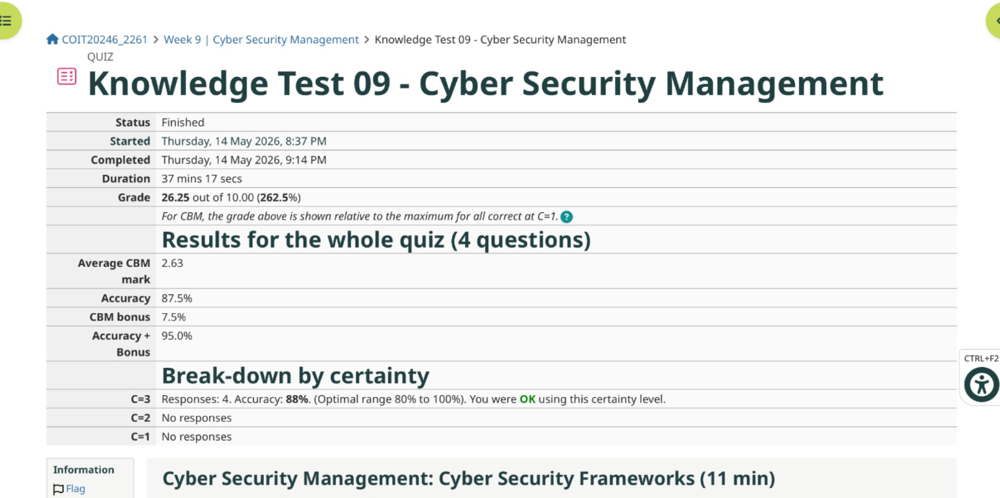
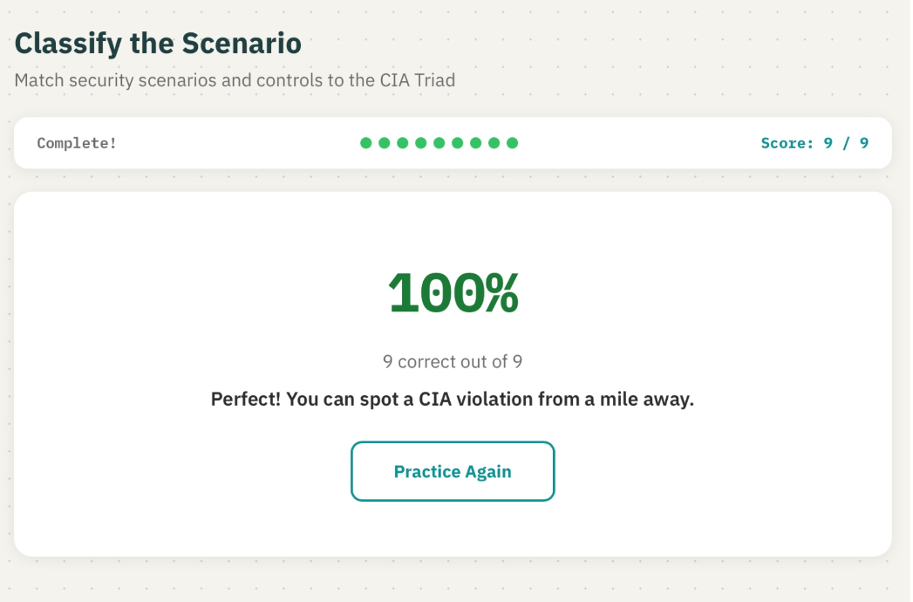
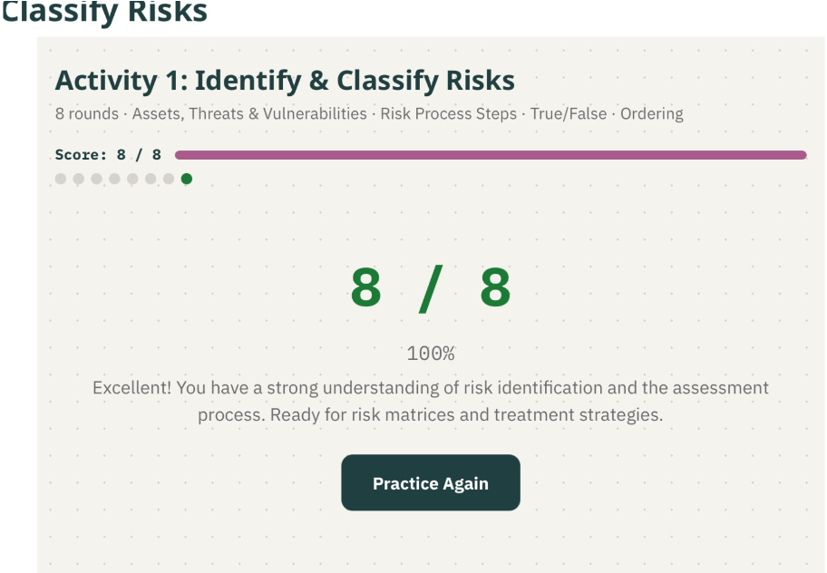
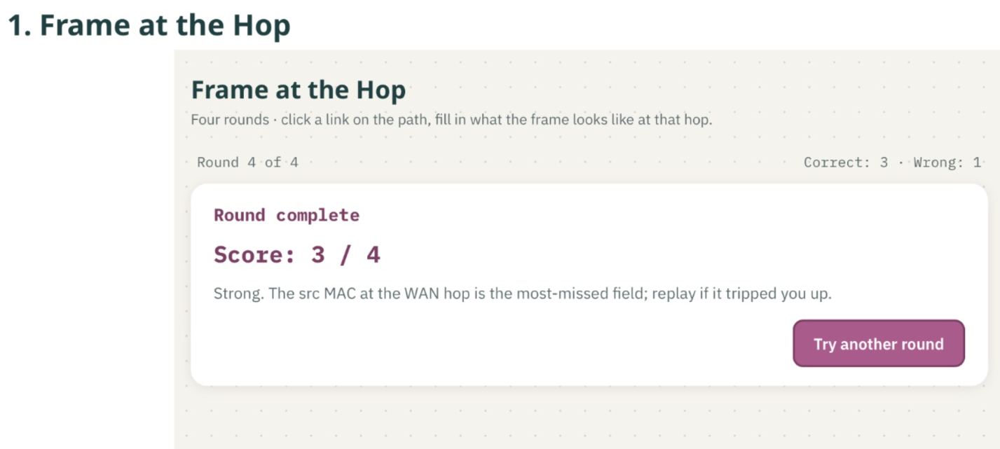

# Week 9 | Cyber Security Management and Practice Activities

**Student Name:** Akash Adhikary  
**Student ID:** 12326091  
**Campus:** Melbourne  

---

## Task 1. Complete the Knowledge Test

I completed the Week 9 Knowledge Test on **Cyber Security Management**.

- **Status:** Finished  
- **Started:** Thursday, 14 May 2026, 8:37 PM  
- **Completed:** Thursday, 14 May 2026, 9:14 PM  
- **Duration:** 37 minutes 17 seconds  
- **Grade:** 26.25 out of 10.00 (262.5%)  
- **Accuracy:** 87.5%  
- **CBM Bonus:** 7.5%  
- **Average CBM Mark:** 2.63  
- **Questions:** 4  

### Reflection on Result

The result shows that I understood most of the cyber security management concepts, but the 87.5% accuracy also indicates that I should revise at least one concept before the exam. The CBM result was positive because I used the high certainty level appropriately for most answers. For revision, I will focus on the difference between security frameworks, risk treatment decisions, and management-level controls because these areas require both technical and governance understanding.

---

## Task 2. Security Basics

For the Security Basics practice activity, I completed the **CIA Triad** activity. The activity required matching scenarios and controls to confidentiality, integrity and availability.

- **Activity:** The CIA Triad  
- **Score:** 9 out of 9  
- **Percentage:** 100%  

### Explanation

The CIA Triad is the foundation of information security. **Confidentiality** protects information from unauthorised disclosure, **integrity** protects information from unauthorised or accidental modification, and **availability** ensures that authorised users can access systems and data when required. This activity helped reinforce that security controls should be selected based on the type of harm being prevented. For example, encryption mainly supports confidentiality, hashing and change control support integrity, while redundancy and backups support availability.

---

## Task 3. Security Techniques

For the Security Techniques practice activity, I completed the **Risk Assessment** activity. This activity involved identifying and classifying risks, including assets, threats, vulnerabilities and risk process steps.

- **Activity:** Identify & Classify Risks  
- **Score:** 8 out of 8  
- **Percentage:** 100%  

### Explanation

The risk assessment activity was useful because it linked cyber security controls to business decision-making. Risk is not only a technical issue; it depends on the value of the asset, the likelihood of a threat exploiting a vulnerability, and the likely impact on the organisation. The activity reinforced that risk management normally follows a structured process: identify assets, identify threats and vulnerabilities, assess likelihood and impact, prioritise risks, and decide on treatment options such as avoiding, reducing, transferring or accepting the risk.

This is directly relevant to cyber security management because organisations cannot protect every system equally. A high-value database with personal information requires stronger controls than a low-value public page because the business impact of compromise is different.

---

## Task 4. Addressing and Routing

For the Addressing and Routing practice activity, I completed **Frame at the Hop**.

- **Activity:** Frame at the Hop  
- **Score:** 3 out of 4  
- **Result:** Round complete  

### Explanation

This activity tested how Ethernet frames change as traffic moves through a network. The key concept is that **IP addresses normally stay the same end-to-end**, because they identify the original source and final destination host. However, **MAC addresses change at every hop**, because they identify the next local Layer 2 device on the current network segment.

My result was 3 out of 4, and the feedback suggested that the source MAC address at the WAN hop is a commonly missed field. This is an important correction. When a packet leaves one router interface and enters the next network segment, the router rebuilds the Layer 2 frame. Therefore, at the WAN hop, the source MAC is the outgoing router interface and the destination MAC is the next-hop router interface. The original sender's MAC address is no longer present beyond the first local segment.

---

## Task 5. Reflection on Learning Activities

This reflection compares the three main learning activities used in COIT20246: knowledge tests and lecture videos, weekly GitHub journal work, and Moodle practice activities.

### 1. Knowledge Tests and Lecture Videos

I used the knowledge tests regularly because they were attached to each weekly topic and provided a quick way to check whether I understood the lecture concepts. I usually spent around **10 to 30 minutes** on each knowledge test, depending on how confident I was with the topic. For the lecture videos and weekly materials, I used them mainly when I needed to revise unfamiliar concepts such as cloud security rules, risk management, routing behaviour or cyber security frameworks.

The knowledge tests helped because they gave immediate feedback and showed whether my confidence level matched my actual understanding. The CBM system was useful because it encouraged me not only to answer correctly, but also to judge how certain I was. However, knowledge tests alone were not enough for deep learning. They helped with terminology and conceptual checking, but practical tasks were still needed to understand how the concepts work in real systems.

### 2. Weekly Journal in GitHub

The weekly GitHub journal was the most consistent learning activity for me. I worked on it almost every week and normally spent **one to two hours** collecting screenshots, running commands, writing explanations and uploading files. The journal helped me organise my evidence and forced me to explain what each screenshot meant rather than simply completing the practical task.

This activity was especially useful for topics such as OpenWRT networking, HTTP packet analysis, Azure VM deployment and routing. By writing the journal, I had to connect command outputs, packet captures, IP addresses, MAC addresses, browser behaviour and security rules into one clear explanation. This improved my technical understanding and also created a revision record that I can review later before the exam. GitHub also supported project-style documentation because files, diagrams, packet captures and screenshots were kept in one repository.

### 3. Practice Activities

The Moodle practice activities were useful because they were interactive and focused on exam-style concepts. I used them mainly during Week 9 and spent around **45 to 60 minutes** completing the CIA Triad, Risk Assessment and Frame at the Hop activities. They helped me identify whether I could apply the concepts, not just define them.

The CIA Triad and Risk Assessment activities were especially useful because they gave immediate scoring and corrected misunderstandings. The Frame at the Hop activity was also valuable because it highlighted a practical networking issue that is easy to confuse: MAC addresses are local to each hop, while IP addresses identify the end-to-end communication path. This type of activity is useful because it turns abstract networking theory into a specific decision-making exercise.

### Most Useful Learning Activity

The most useful activity for this unit was the **weekly GitHub journal**. The journal required the strongest combination of practical skill, explanation, evidence collection and reflection. Knowledge tests helped me check understanding, and practice activities helped reinforce exam concepts, but the journal required me to perform real technical work and explain it clearly. It also helped me build a portfolio of networking and cyber security tasks, including OpenWRT, Wireshark, Azure, routing, ARP, HTTP and cloud security. For the remainder of the unit, I would continue using the weekly journal as my main revision resource and use the knowledge tests and practice activities to identify weak topics.

---

## Summary of Week 9 Learning

Week 9 strengthened my understanding of cyber security from both management and technical perspectives. The activities showed that security is not limited to tools; it also involves risk assessment, control selection, governance and decision-making. The CIA Triad activity reinforced the purpose of core security controls, the risk activity connected threats and vulnerabilities to business impact, and the addressing activity corrected an important Layer 2/Layer 3 networking concept. Overall, Week 9 helped link earlier technical networking topics with later cyber security management concepts.
